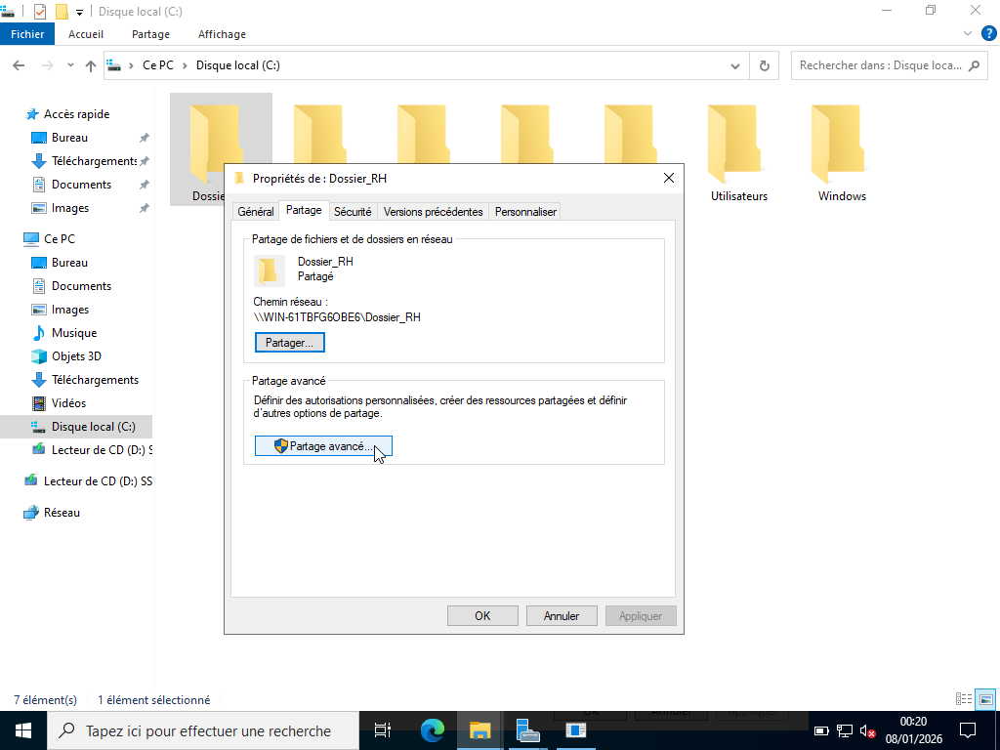
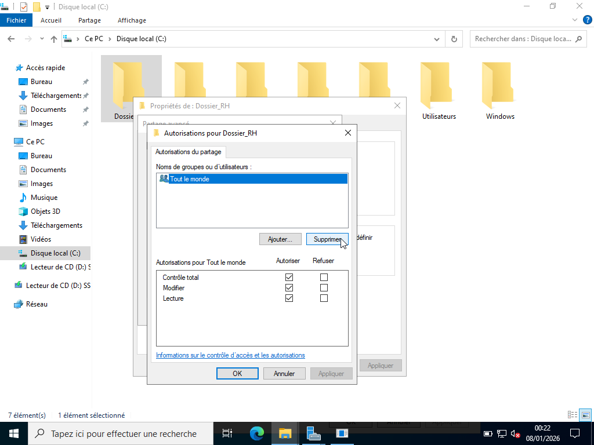

# ATTRIBUTIONS DES DROITS DE PARTAGE SMB

---

## Objectif :

Attribuer aux Groupes du Domaine Local (DLG) les droits de partage SMB.

| Dossiers     | OU_Groupes  | DLG      | Droits de partage SMB                                                                |
|--------------|-------------|----------|--------------------------------------------------------------------------------------|
| Dossier_RH   | DLG         | DLG_RH   | Full Control (Contrôle total) : Modification + gestion des permissions du partage.   | 
| Dossier_INF  | DLG         | DLG_INF  | Change (Modification) : Lecture + modification, suppression, création de fichiers.   |
| Dossier_CP   | DLG         | DLG_CP   | Read (Lecture) : L’utilisateur peut lire, ouvrir, lister les fichiers.               |

## Procédure :

Pour l'attribution des droits de partage, la procédure est la suivante :

1. Clic droit sur le dossier partagé (ex : Dossier_RH)

2. Propriétés 

3. Onglet Partage 

4. Partage avancé 

5. Cocher Partager ce dossier 

6. Cliquer sur Autorisations 

7. Supprimer “Tout le monde” 

8. Ajouter le Groupe Domaine Local (ex : DLG_RH) 

9. Donner les droits associés au groupe. (ex : Full Control).

---

## Démonstration :

Pour la démonstration, nous nous servirons d'un seul exemple.

