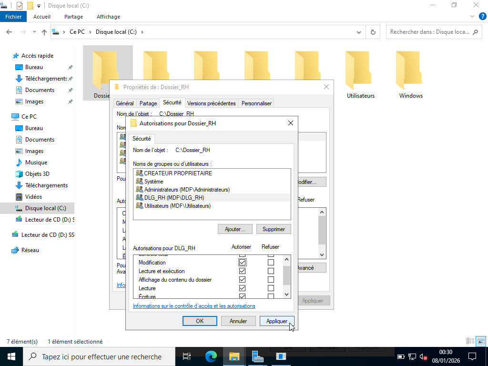
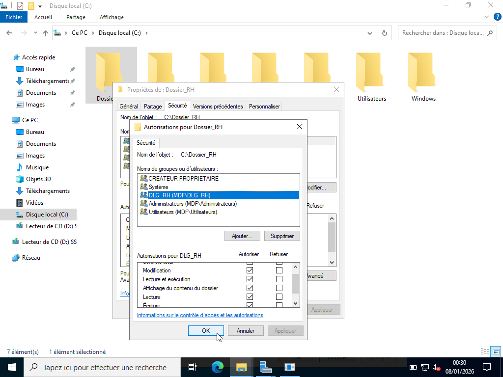
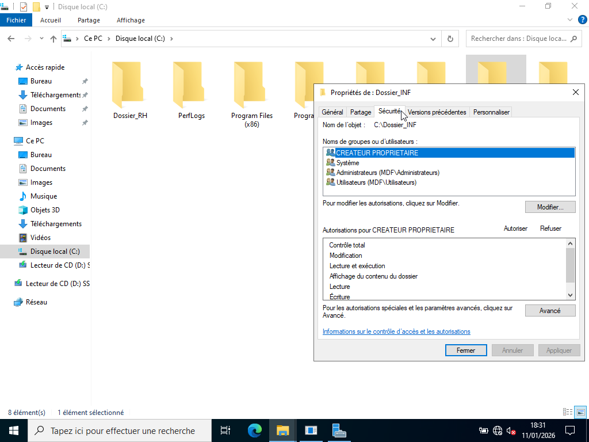
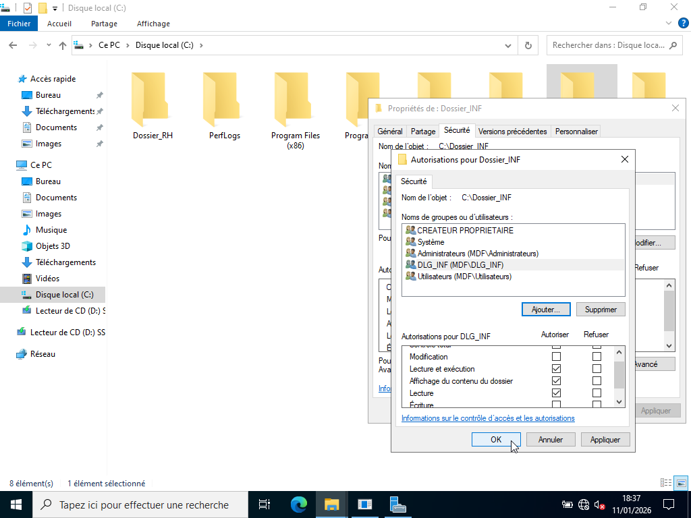
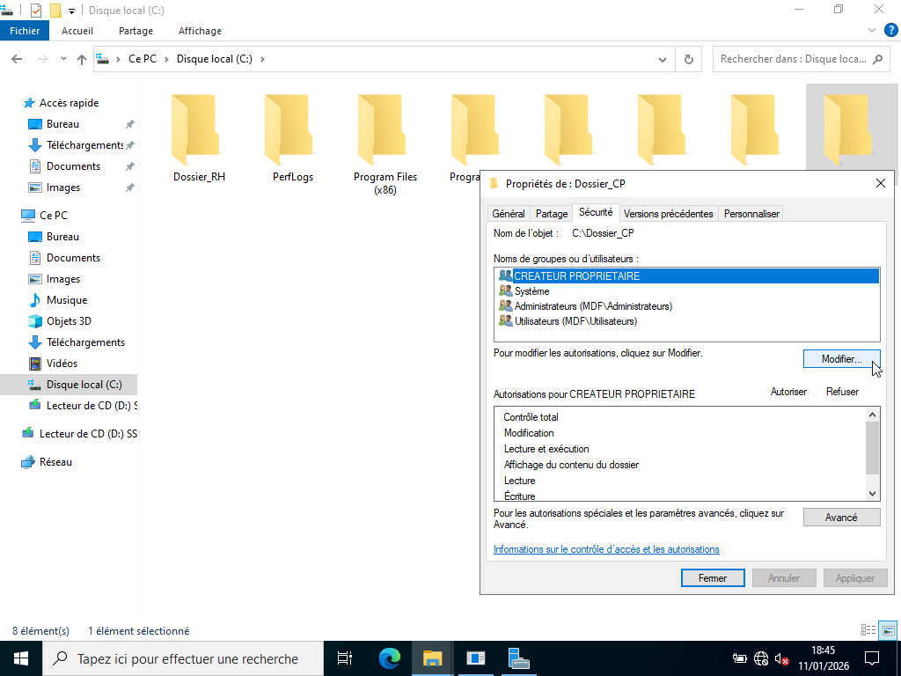
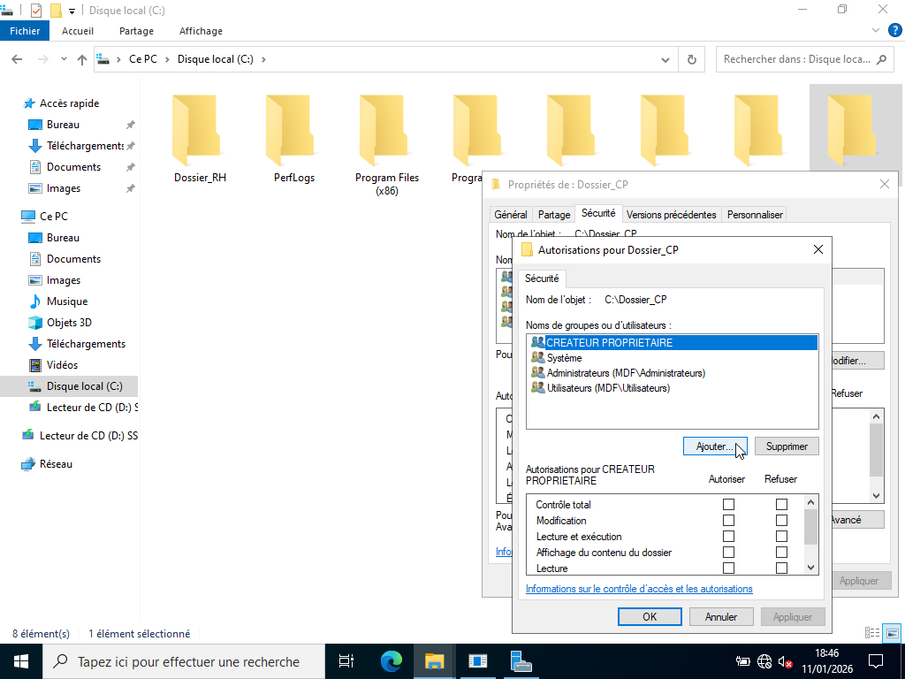
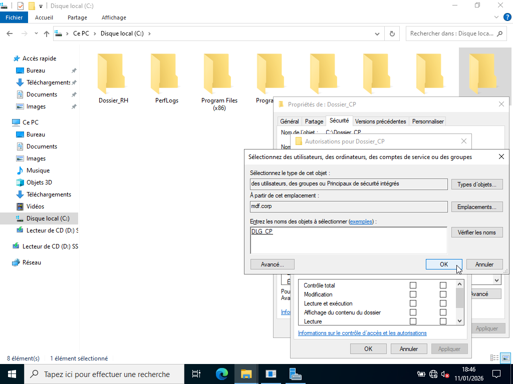
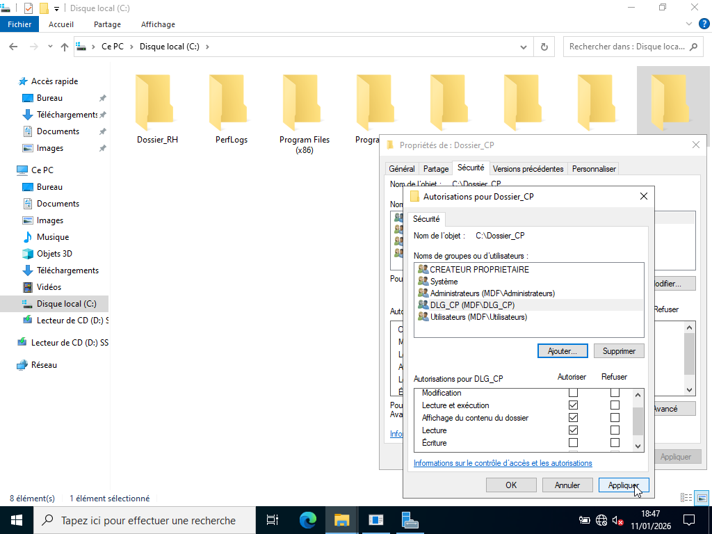
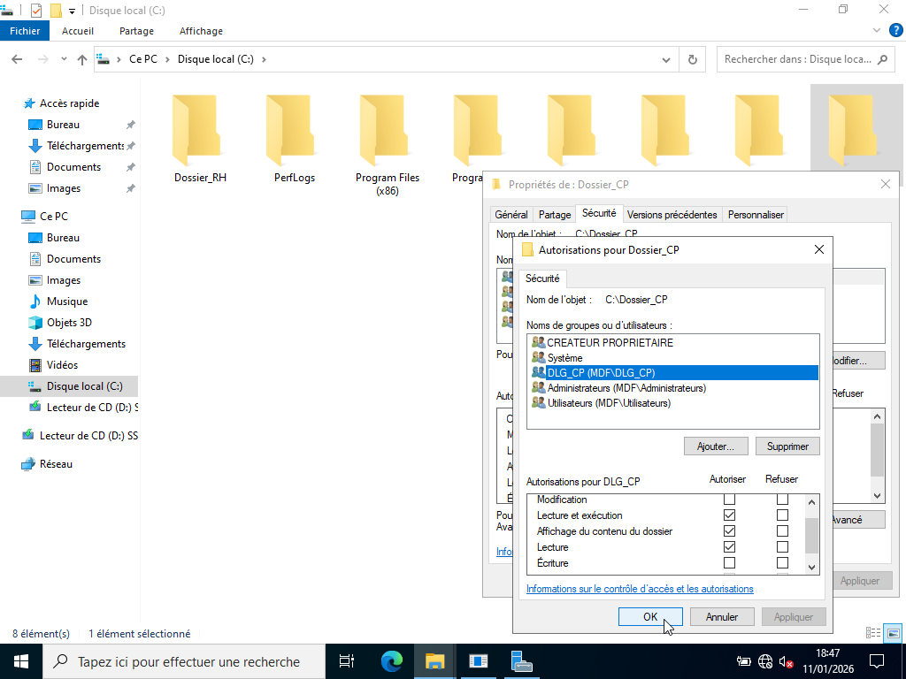

# ATTRIBUTIONS DES PERMISSIONS NTFS

---

## Procédure :

Les permissions NTFS s'appliquent sur le disque dans l'onglet sécurité en suivant la procédure suivante :

1. Clic droit sur le dossier (ex : Dossier_RH)

2. Propriétés

3. Onglet sécurité

4. Cliquer sur Modifier

5. Ajouter le Groupe Domaine Local (ex : DLG_RH)

6. Donner les droits associés au groupe. (ex : Change).

| Dossiers     | OU_Groupes | DLG     | Permissions NTFS                                                                     |
|--------------|------------|---------|--------------------------------------------------------------------------------------|
| Dossier_RH   | DLG        | DLG_RH  | Change (Modification) : Lecture + modification, suppression, création de fichiers.   | 
| Dossier_INF  | DLG        | DLG_INF | Read (Lecture) : L’utilisateur peut lire, ouvrir, lister les fichiers.               |
| Dossier_CP   | DLG        | DLG_CP  | Read (Lecture) : L’utilisateur peut lire, ouvrir, lister les fichiers.               |

---

## Démonstrations : 

- Permissions NTFS du Dossier_RH

- Permissions NTFS du Dossier_INF

- Permissions NTFS du Dossier_CP

