# CREATION GG ET DLG

---

## Objectifs :

- Créer des Groupes Globaux (GG) qui serviront à regrouper les utilisateurs selon leur service afin d’appliquer ensuite le modèle AGDLP. 
- Créer ensuite des Groupes Domaines Local (DLG) qui seront utilisés pour attribuer des permissions NTFS/SMB sur les dossiers partagés du serveur. 

---

## Procédure création des GG :

Pour la création des GG, la procédure utilisée est la suivante  :

1. Aller dans : OU_Groupes → GG 

2. Clic droit → Nouveau → Groupe 

3. Renseigner : 

- Nom du Groupe Global (ex : GG_RH) 

- Portée : Global 

- Type : Sécurité 

4. Valider. 

| Services              | OU_Groupes  | GG         |
|-----------------------|-------------|------------|
| Ressources Humaines   | GG          | GG_RH      |
| Informatique          | GG          | GG_INF     |
| Comptabilité          | GG          | GG_CP      |

---

## Démonstration création des GG : 

- Création du GG_RH

- Création du GG_INF

- Création du GG_CP

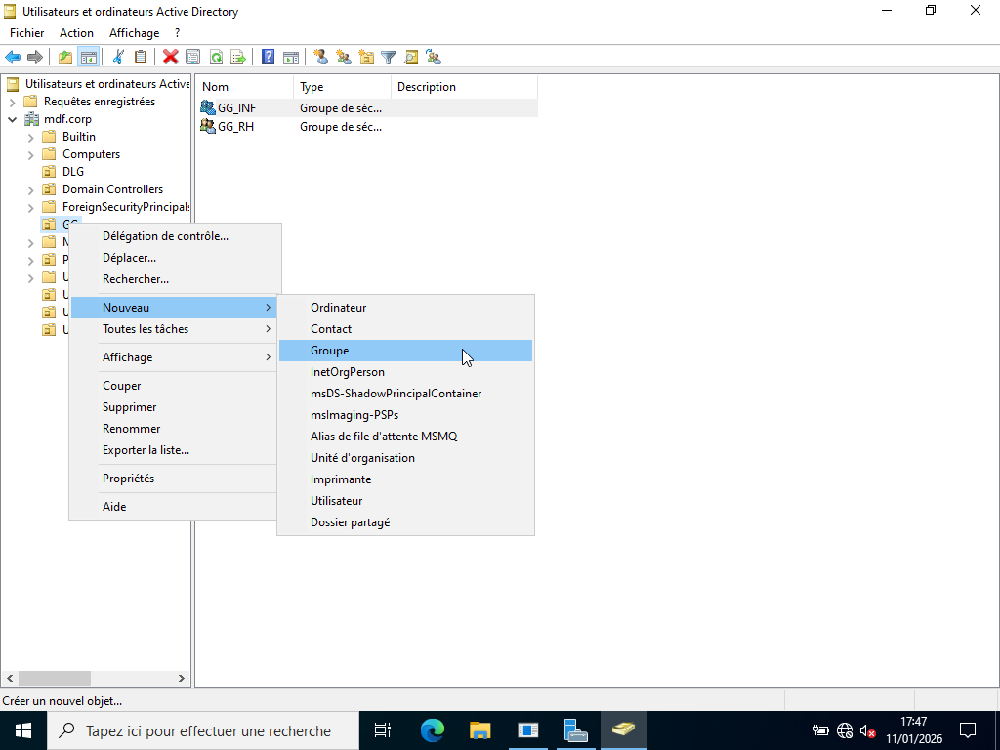

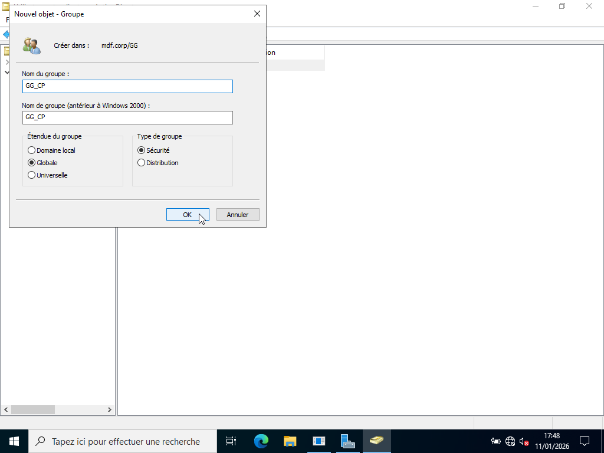

---

## Procédure création des DLG :

Pour la création des DLG, la procédure utilisée est la suivante  :

1. Aller dans : OU_Groupes → DLG 

2. Clic droit → Nouveau → Groupe 

3. Renseigner : 

- Nom du Groupe Global (ex : DLG_RH) 

- Portée : Local de domaine

- Type : Sécurité 

4. Valider. 

| Services              | OU_Groupes | DLG       |
|-----------------------|------------|-----------|
| Ressources Humaines   | DLG        | DLG_RH    |
| Informatique          | DLG        | DLG_INF   |
| Comptabilité          | DLG        | DLG_CP    |

---

## Démonstration création des DLG : 

- Création du DLG_RH

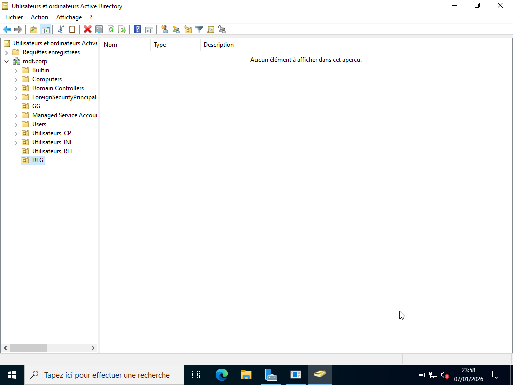

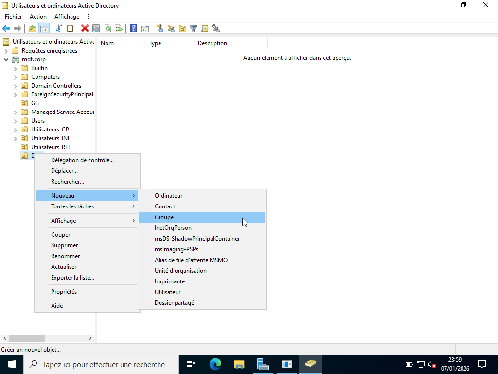

- Création du DLG_INF

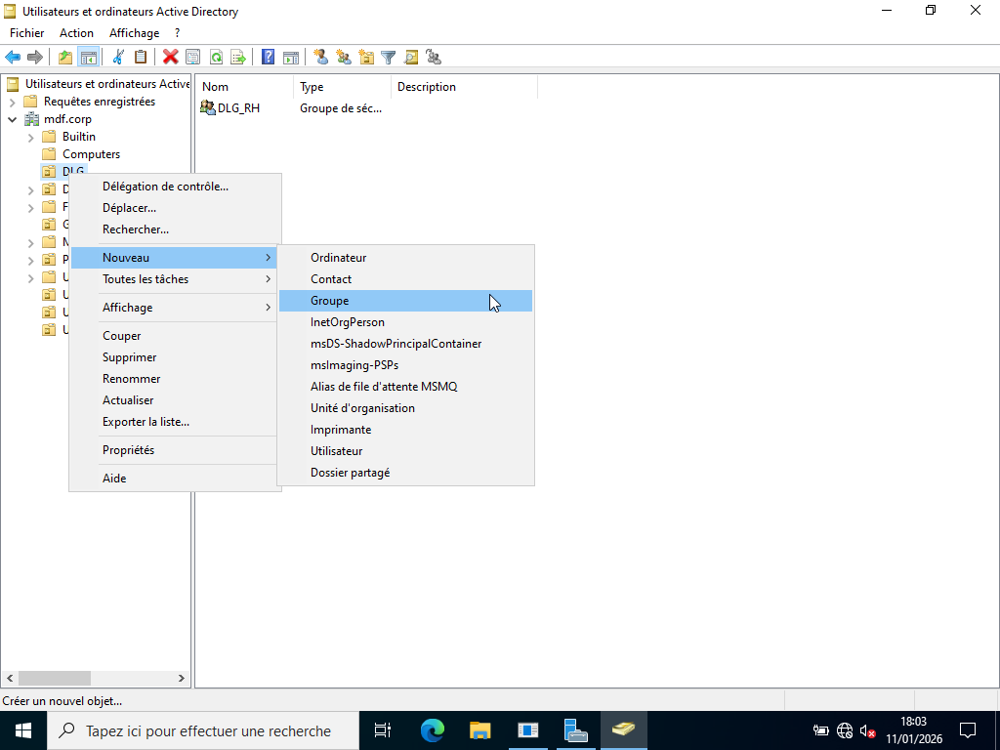

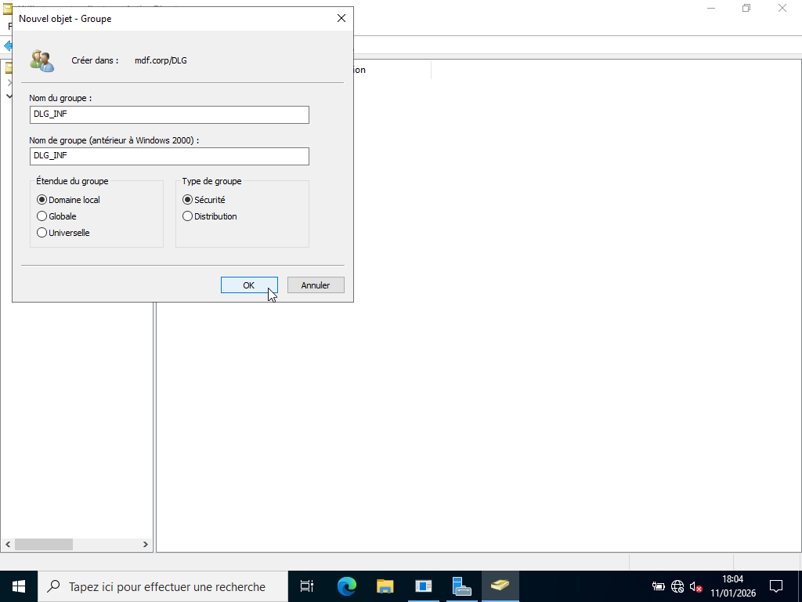

- Création du DLG_CP

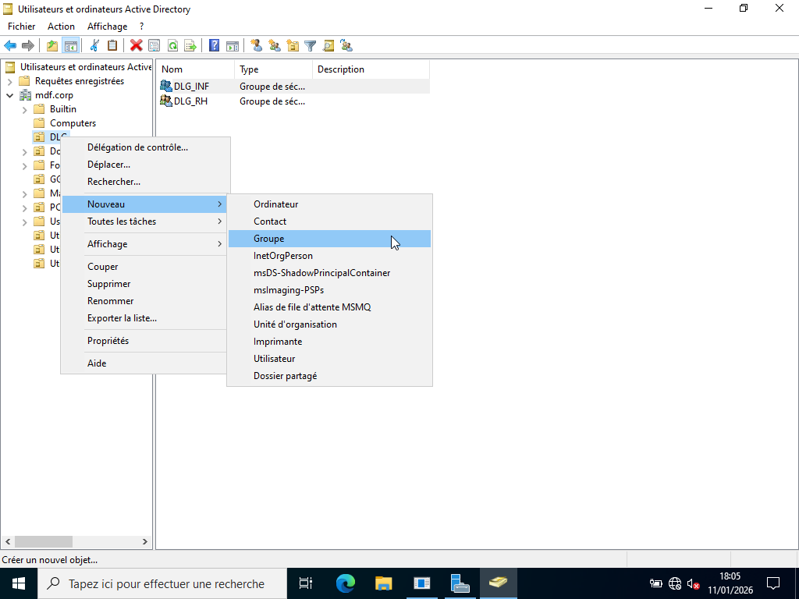

---

## Procédure d'ajout des utilisateurs au GG :

Pour l'ajout des utilisateurs au GG, la procédure utilisée est la suivante :

1. Aller dans l’OU contenant l’utilisateur (ex : Utilisateur_RH) 

2. Clic droit sur l’utilisateur (ex : Placide) 

3. Sélectionner Ajouter au groupe 

4. Entrer le groupe global (ex : GG_RH) 

5. Valider.

| Services              | OU_Groupes   | OU_Utilisateurs   | Utilisateur  |
|-----------------------|--------------|-------------------|--------------|
| Ressources Humaines   | GG_RH        | Utilisateur_RH    |  Placide     |
| Informatique          | GG_INF       | Utilisateur_INF   |  Fortuné     |
| Comptabilité          | GG_CP        | Utilisateur_CP    |  Hugues      |

---

## Démonstration d'ajout des utilisateurs au GG :

- Ajout Utilisateur_RH du nom de Placide au GG_RH

- Ajout de Utilisateur_INF du nom de Fortuné au GG_INF

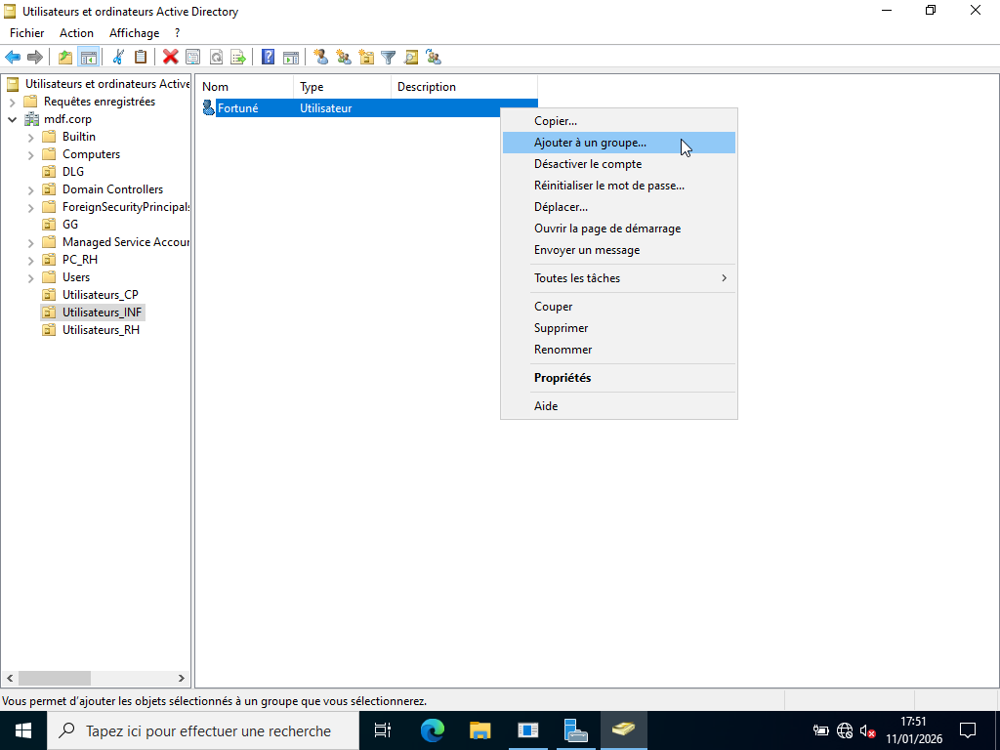

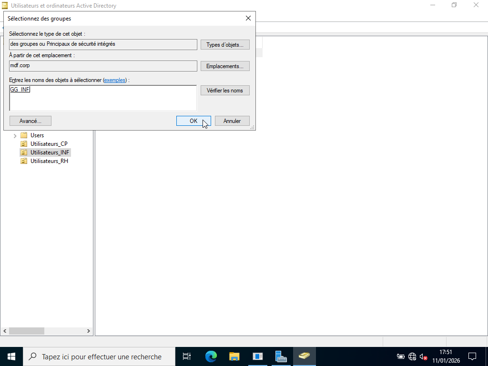

- Ajout de Utilisateur_CP du nom de Hugues au GG_CP

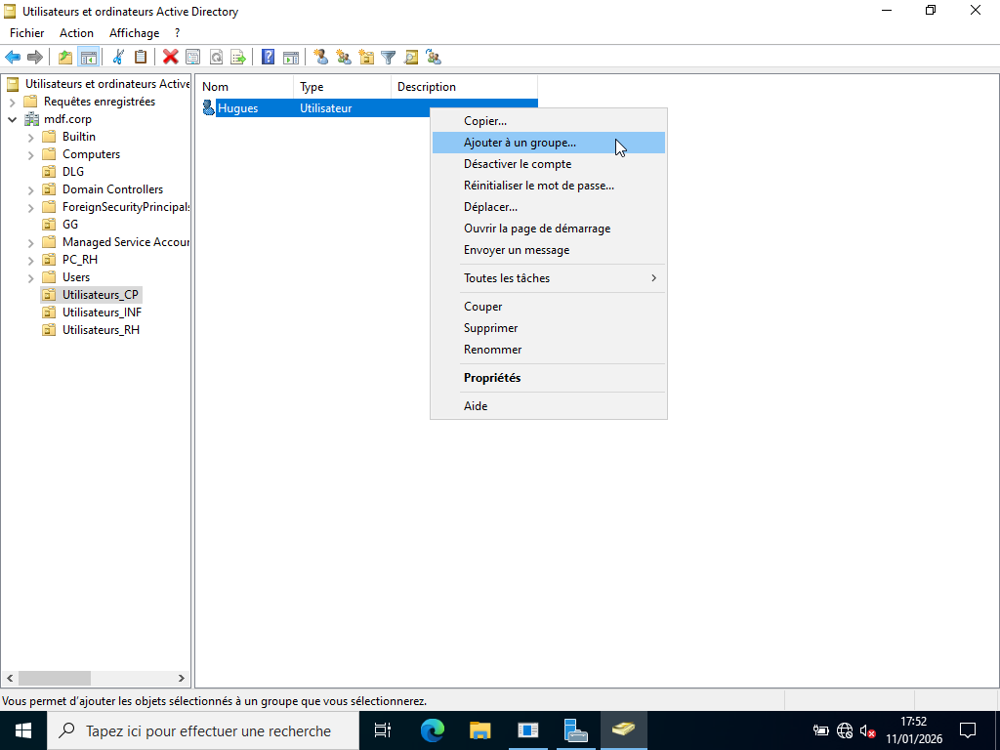

---

## Procédure d'ajout des GG aux DLG :

Pour l'ajout des GG aux DLG, la procédure utilisée est la suivante :

1. Aller dans : OU_Groupes → GG 

2. Clic droit sur le groupe global (ex : GG_RH)
 
3. Sélectionner Ajouter au groupe 

4. Entrer le Groupe Domaine Local (ex : DLG_RH) 

5. Valider.

| Services              | GG       | DLG       |
|-----------------------|----------|-----------|
| Ressources Humaines   | GG_RH    | DLG_RH    |
| Informatique          | GG_INF   | DLG_INF   |
| Comptabilité          | GG_CP    | DLG_CP    |

---

## Démonstration d'ajout des GG aux DLG :

- Ajout du GG_RH au DLG_RH

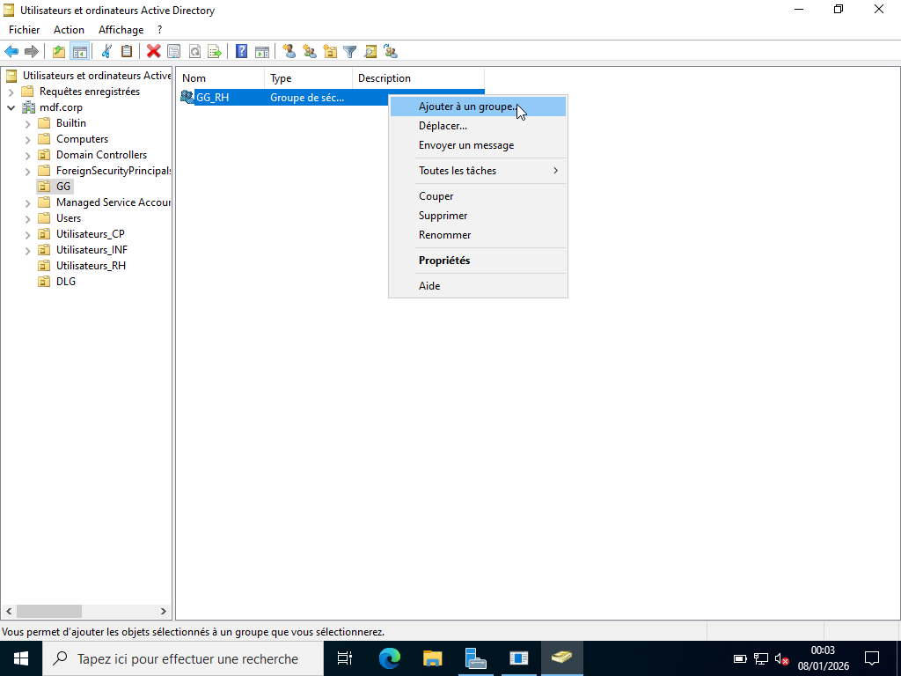

- Ajout du GG_INF au DLG_INF

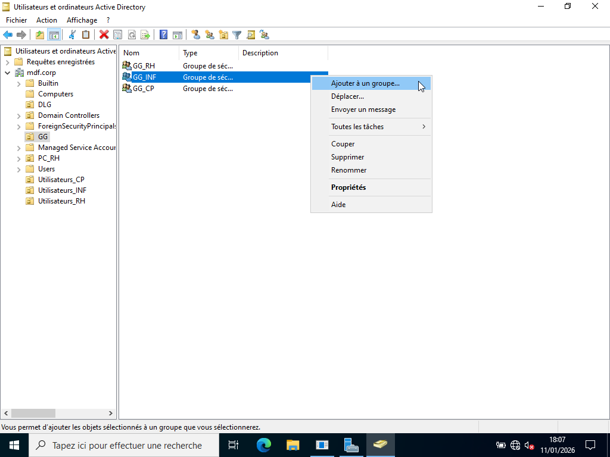

- Ajout du GG_CP au DLG_CP

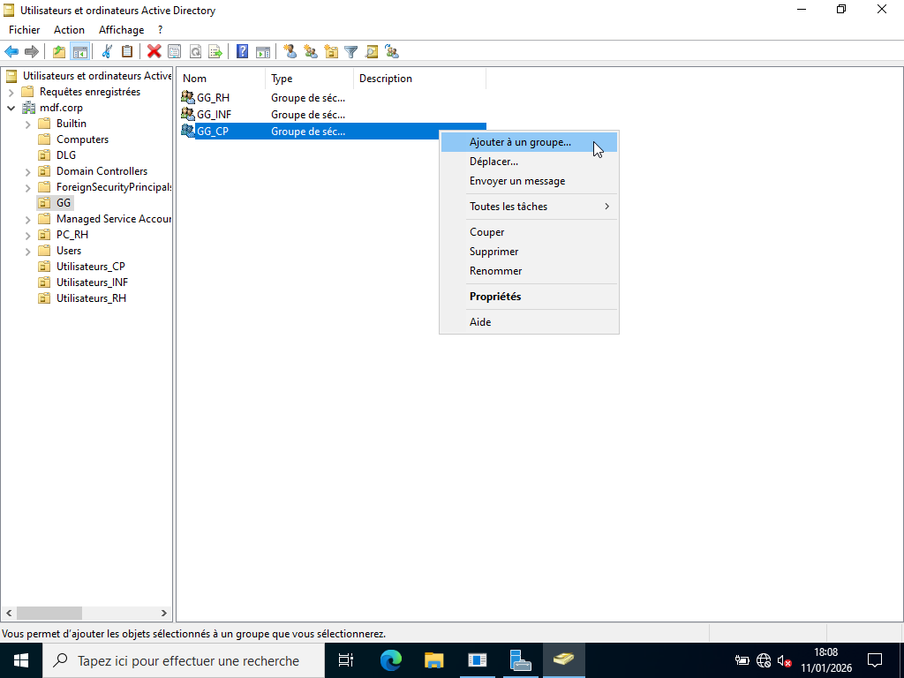

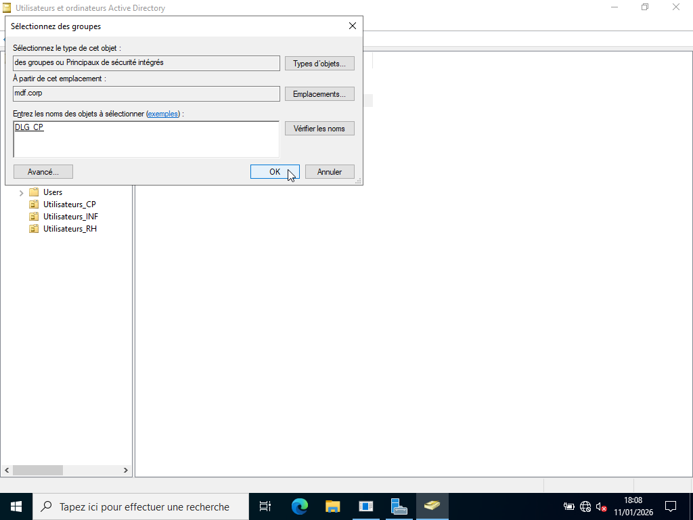

