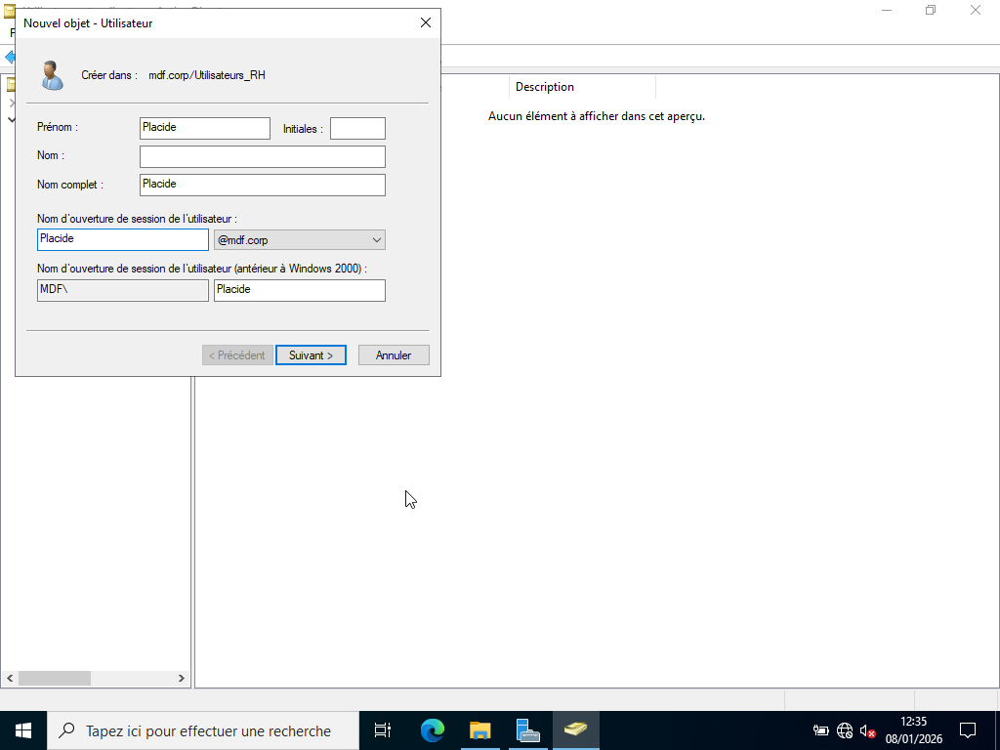
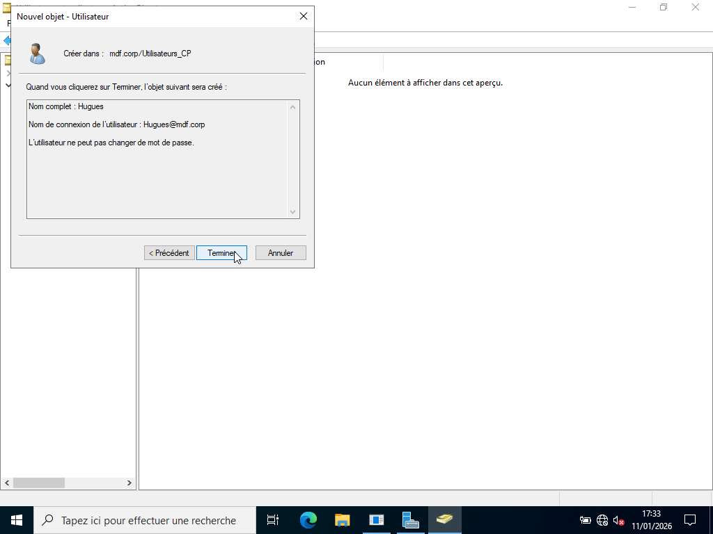

# CREATION COMPTES UTILISATEURS

---

## Objectif :

Créer des comptes utilisateurs dans l’OU correspondant à leur service afin de maintenir une organisation claire et professionnelle du domaine Active Directory. 

---
 
## Procédure :

La procédure utilisée est la suivante : 

1. Ouvrir Utilisateurs et ordinateurs Active Directory 

2. Clic sur le domaine 

3. Naviguer jusqu’à l’OU du service concerné (ex : Utilisateur_RH) 

4. Clic droit → Nouveau → Utilisateur 

5. Renseigner les informations :  

- Prénom (ex : Placide)

- Nom  

- Nom d’ouverture de session (ex : Placide) 

6. Définir un mot de passe conforme à la politique de sécurité 

7. Valider la création du compte. 

| Services              | OU_Utilisateurs  | Utilisateur |
|-----------------------|------------------|-------------|
| Ressources Humaines   | Utilisateur_RH   | Placide     | 
| Informatique          | Utilisateur_INF  | Fortuné     |
| Comptabilité          | Utilisateur_CP   | Hugues      |

---

## Démonstrations :

- Création compte utilisateur_RH du nom de Placide

- Création compte utilisateur_INF du nom de Fortuné

- Création compte utilisateur_CP du nom de Hugues

