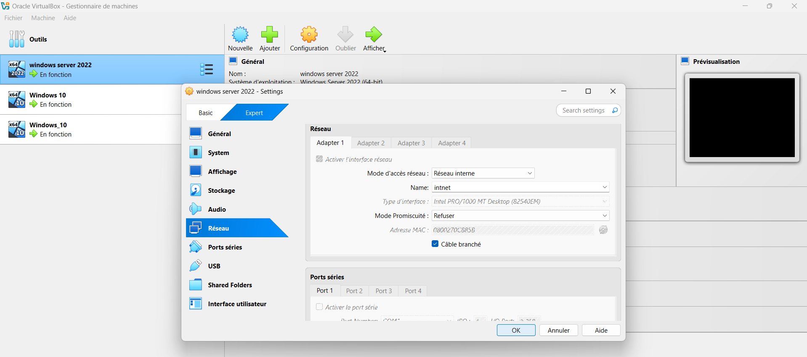

# ACTIVATION CARTES RESEAUX

---

## Objectif :

Rendre fonctionnel l’interface qui permet aux postes clients de communiquer avec le serveur du domaine active directory.

---

## Procédure :

Pour activer la carte réseau, la procédure est la suivante :

1. Ouvrir VirtualBox

2. Choix de la machine ( ex : Poste client Windows 10, Windows Server 22)

3. Onglet Réseau 

- Coche la case "Activer l’interface réseau" 

- Mode d’accès réseau : Réseau interne 

- Nom : intnet

- Type d’interface : Intel PRO/1000 MT Desktop (82540EM)

- Câble branché : coché ✅ 

---

## Démonstrations :

Pour la démonstration, nous nous servirons de deux exemples.

- Activation carte réseau sur Windows server 22

- Activation carte réseau sur un poste client Windows 10

