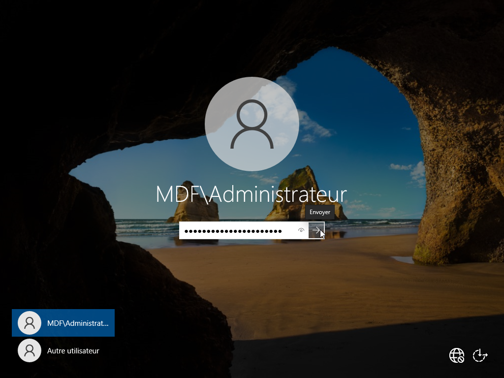
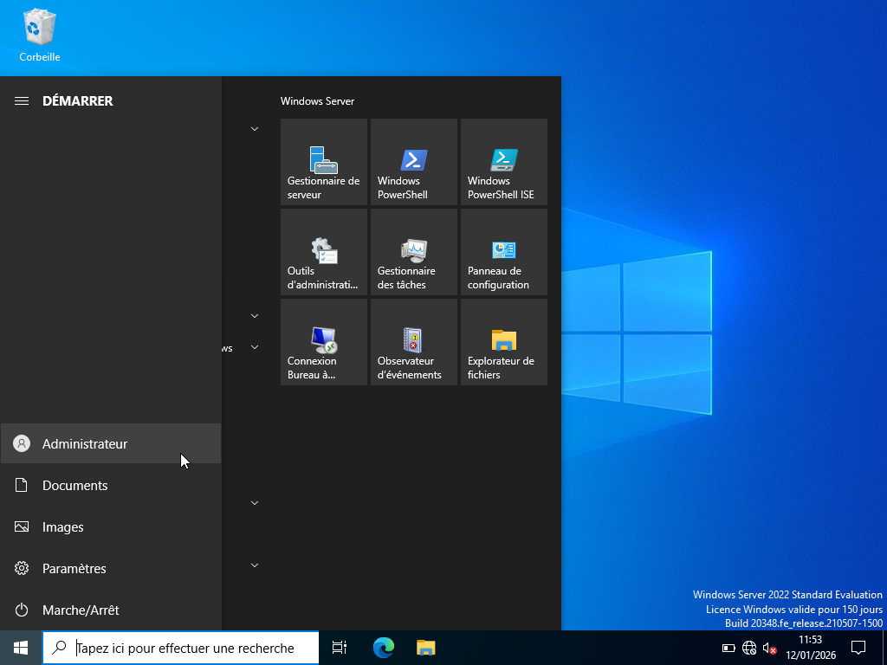
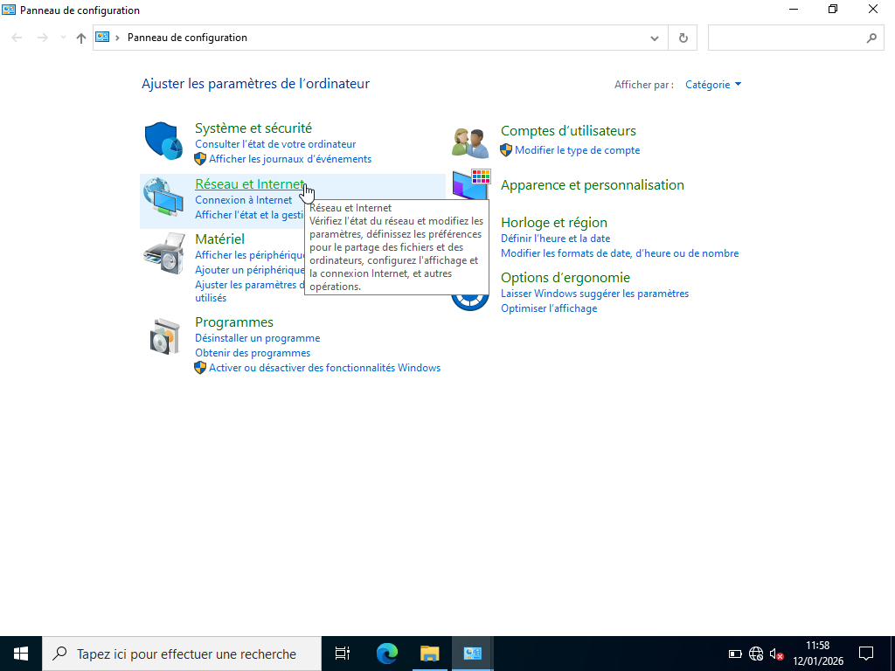
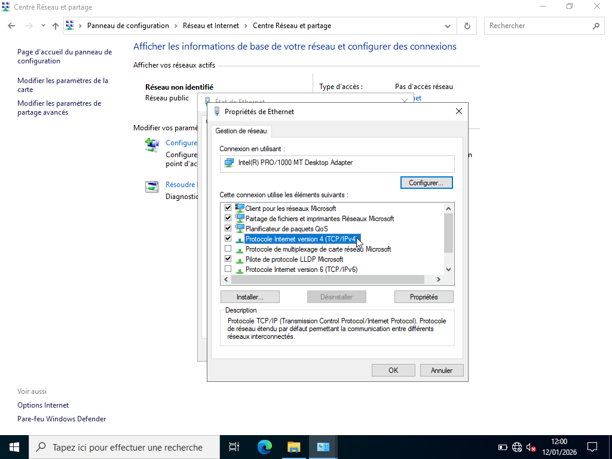

# CONFIGURATION DU RESEAU 

---

## Objectif :

Structurer la manière dont Windows server et les postes clients vont communiquer, partager des ressources et fonctionner ensemble. Sans configuration, un réseau serait un ensemble de machines isolées, incapables de se comprendre.

| Services             | Machines            | IP         |  Masque        |  Passerelle    | Serveur DNS préféré |
|----------------------|---------------------|------------|----------------|----------------|---------------------|
| Ressources Humaines  | PC_RH Windows 10    | 10.0.0.20  | 255.255.255.0  |      /         |   10.0.0.10         | 
| Informatique         | PC_INF Windows 10   | 10.0.0.30  | 255.255.255.0  |      /         |   10.0.0.10         |
| Comptabilité         | PC_CP Windows 10    | 10.0.0.40  | 255.255.255.0  |      /         |   10.0.0.10         |
| Administration       | Windows server 22   | 10.0.0.10  | 255.255.255.0  |      /         |   10.0.0.10         |                     

---

## Procédure :

La procédure effectuée est la suivante :

1. Accéder au panneau de configuration

2. Réseau et Internet

3. Centre de partage et réseau

4. Ethernet

5. Protocole Internet version 4 (TCP/IPv4)

6. Configurer le réseau. 

---

## Démonstrations :

Pour la démonstration, nous nous servirons d'un seul exemple.

- Configuration du réseau sur le Serveur Windows Server 22, effectuée par l'administrateur

- Configuration du réseau sur un poste client Windows 10 PC_RH, effectuée par l'utilisateur_RH du nom de Placide

