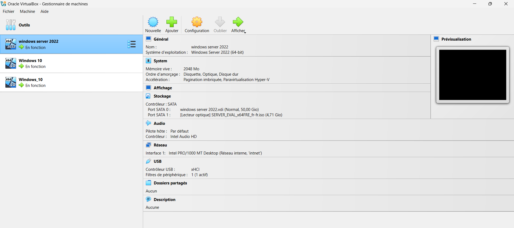

# Activation carte réseau

---

## Procédure :

Pour activer la carte réseau, la procédure est la suivante :

1. Sur VirtualBox → Paramètres de la VM client 

2. Onglet Réseau 

3. Coche la case "Activer l’interface réseau" 

4. Vérifie que : 

- Mode d’accès réseau = Réseau interne 

- Nom = le même que sur le serveur (ex : intnet) 

- Type d’interface = Intel PRO/1000 MT Desktop (82540EM)

- Câble branché = coché ✅ 

---

## Démonstrations :

- Activation carte réseau sur Serveur Windows server

- Activation carte réseau sur le poste client

