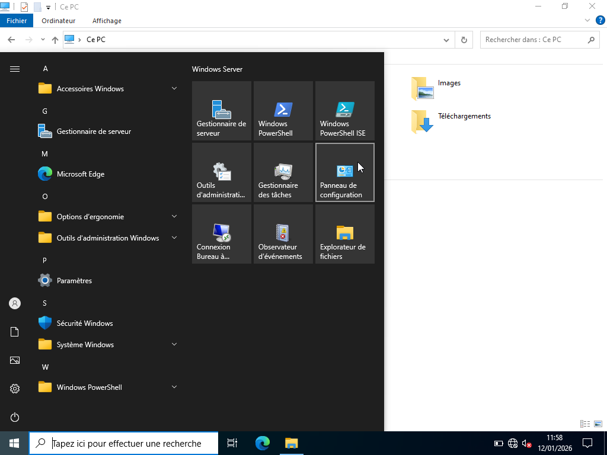
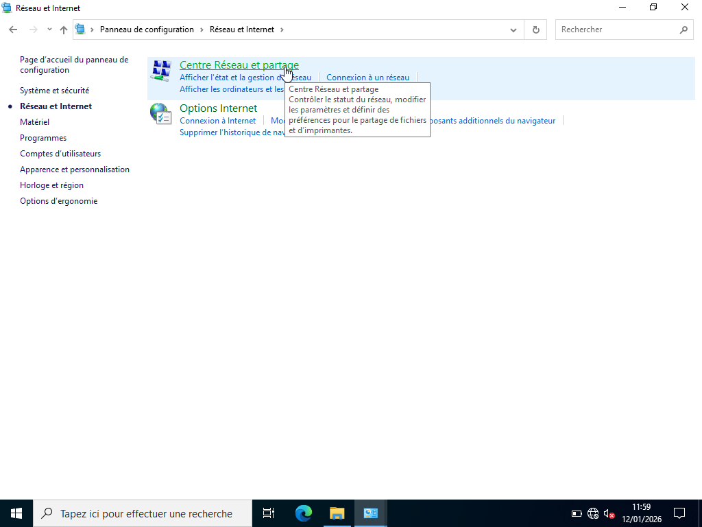
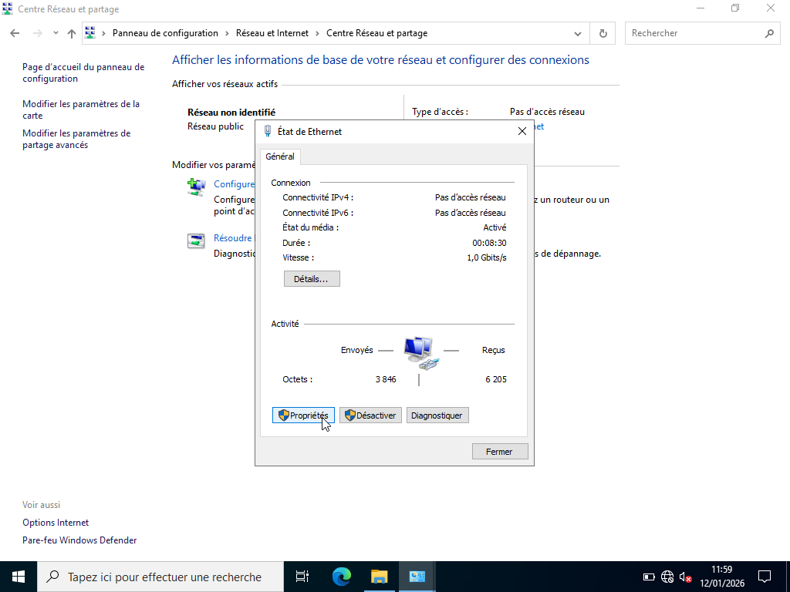
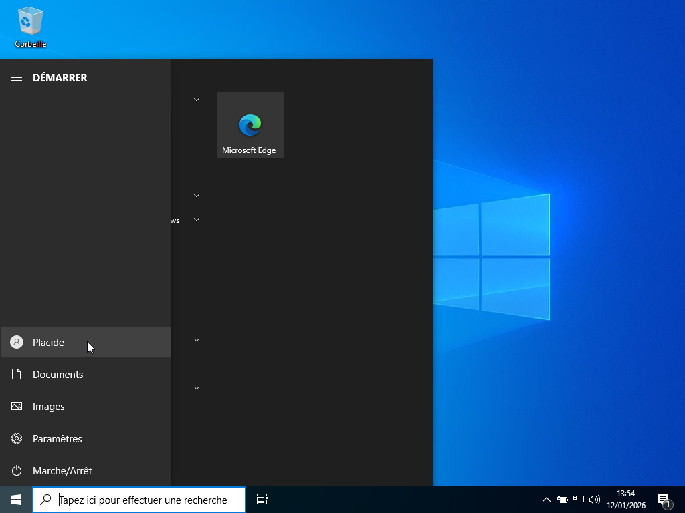
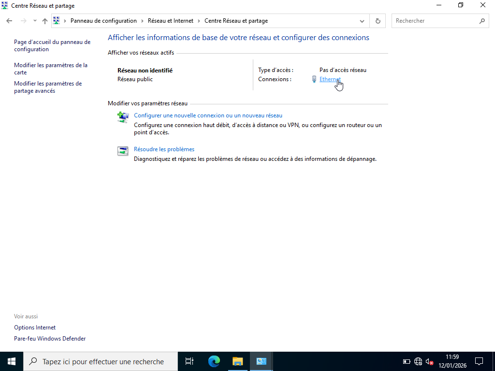
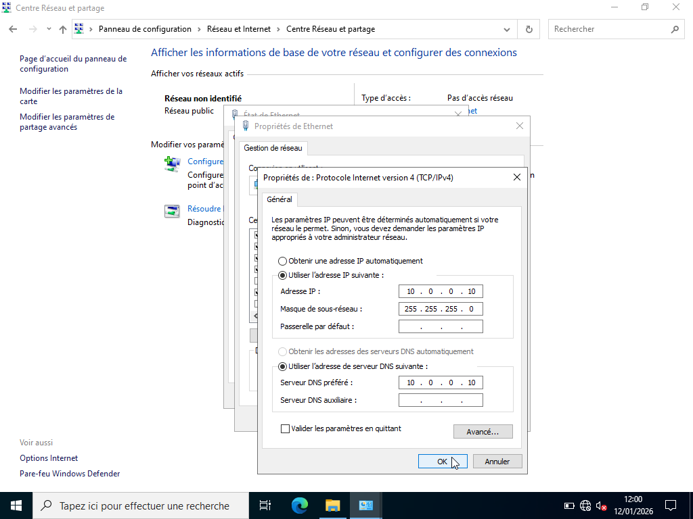

# Configuration du réseau  

---

## Procédure :

La procédure de configuration du réseau est la suivante :

1. Accéder au panneau de configuration

2. Cliquer sur Réseau et Internet

3. Cliquer sur centre de partage et réseau

4. Cliquer sur Ethernet

5. Choisir Propriétés

6. Dans la liste, sélectionner : Protocole Internet version 4 (TCP/IPv4)

7. Configurer le réseau. 

| Machines               | IP         |  Masque       |  Passerelle    | Serveur DNS préféré |
|------------------------|------------|---------------|----------------|---------------------|
| Poste client (PC)      | 10.0.0.20  | 255.255.255.0 |      /         |   10.0.0.10         | 
| Serveur Windows Server | 10.0.0.10  | 255.255.255.0 |       /        |   10.0.0.10         |                     

---

## Démonstrations :

- Configuration du réseau sur le Serveur Windows Server, effectuée par l'administrateur

- Configuration du réseau sur le poste client, effectuée par l'utilisateur_RH du nom de Placide

