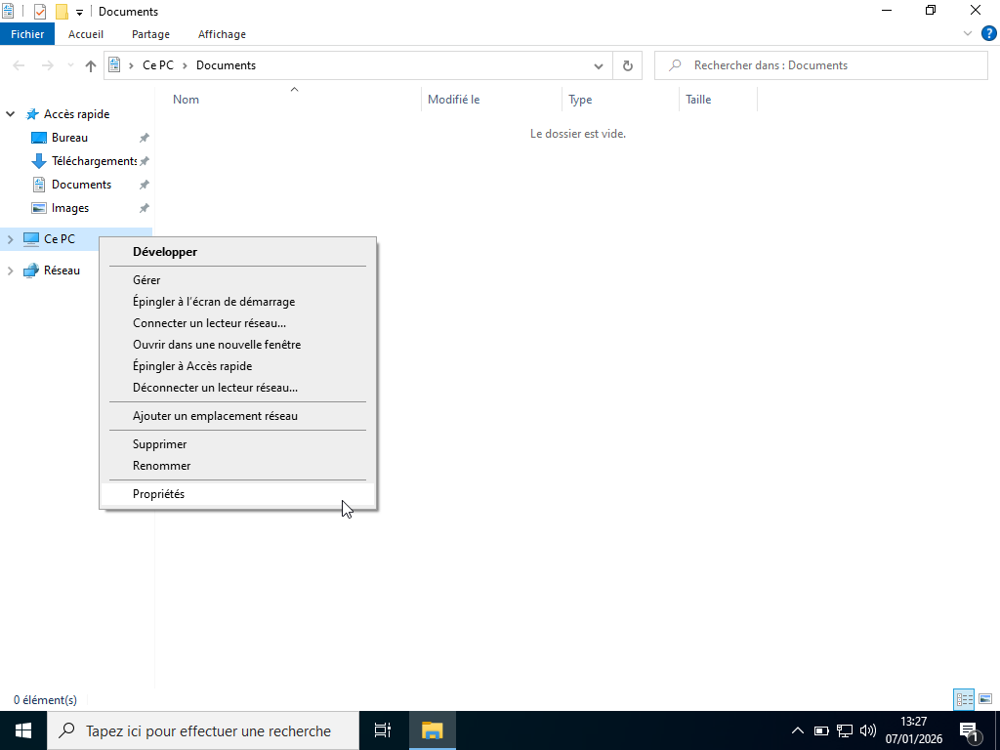
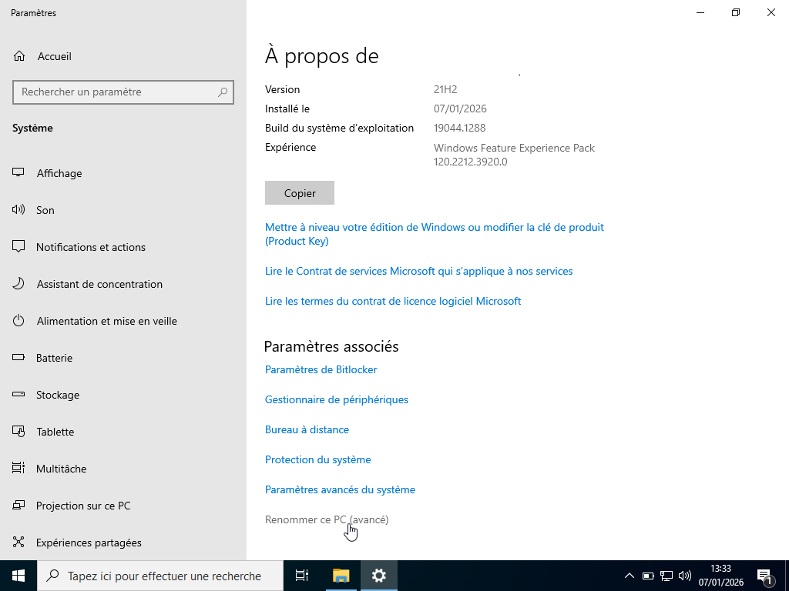
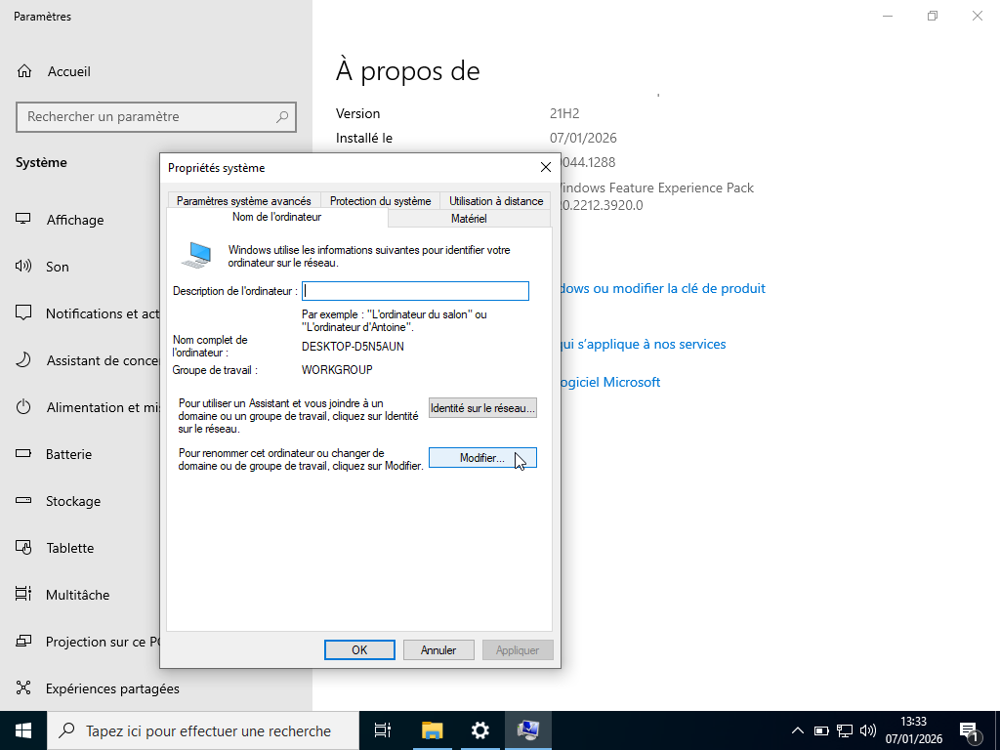
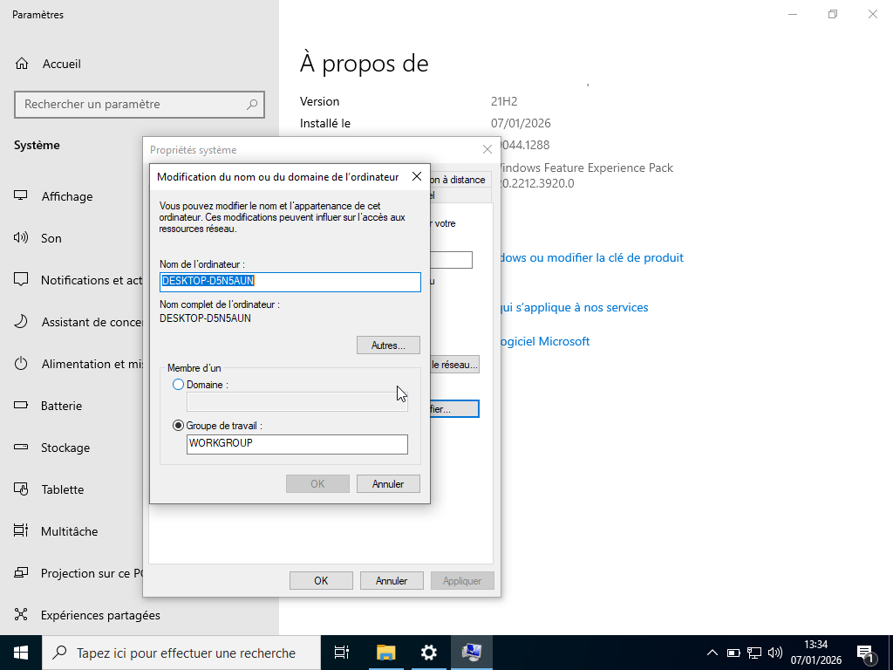
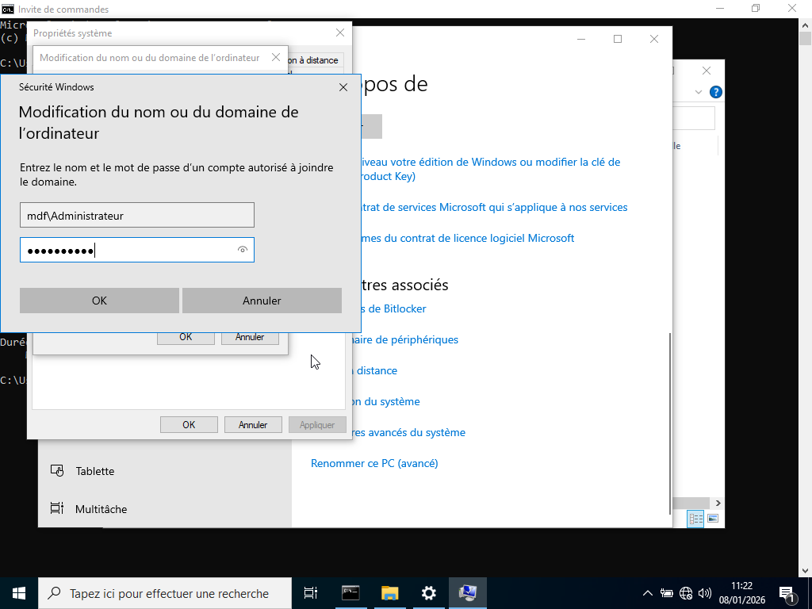
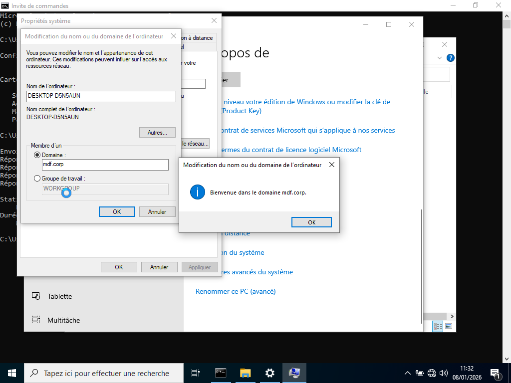
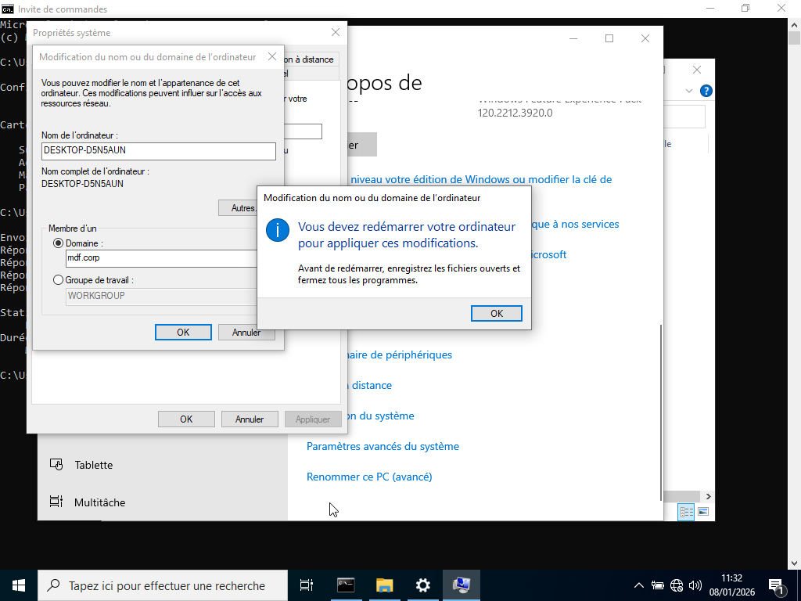
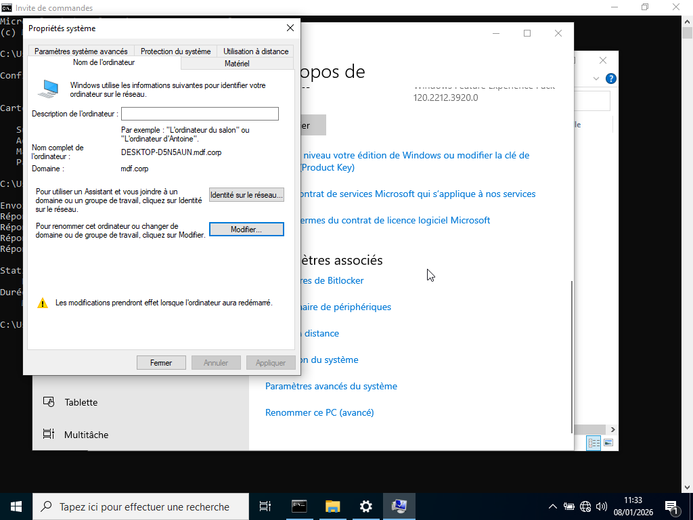
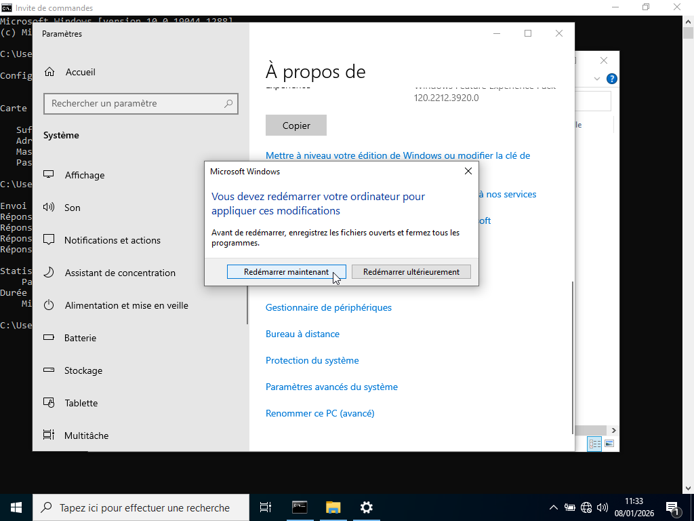

# Jonction du poste client au domaine

---

## Procédure :

Pour joindre le poste client au domaine, la procédure est la suivante :

1. Clic droit sur PC 

2. Propriété 

3. Cliquer sur renommer ce PC

4. Modifier

4. Entrer un domaine : mdf.corp 

5. Fournir un compte admin du domaine (ex : Administrateur) suivi de son passeword 

6. Redémarrer le poste client.

---

## Démonstration jonction du poste client au domaine :

