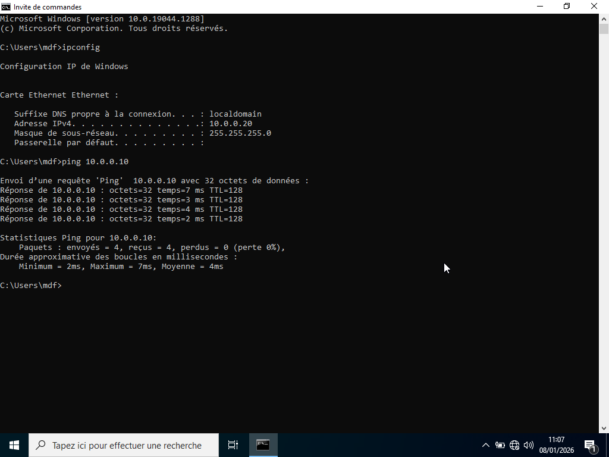

# Test de configuration 

---

## Objectif :

Avant toute tentative de joindre le domaine, il faut s’assurer que le poste client peut communiquer avec le contrôleur de domaine.

---

## Procédure :

On test la configuration réseau du poste client dans l'invite de commande :
 
- ipconfig : Pour confirmer que le poste client a une adresse IP dans le même réseau que le serveur. Pour Vérifier que le DNS pointe vers le contrôleur de domaine.

- Ping 10.0.0.10 : Pour vérifier que le poste client peut joindre le serveur. Pour confirmer que les deux machines sont dans le même réseau VirtualBox. Pour s’assurer que le serveur est allumé et que le pare‑feu ne bloque pas ICMP.

---

## Démonstration :

