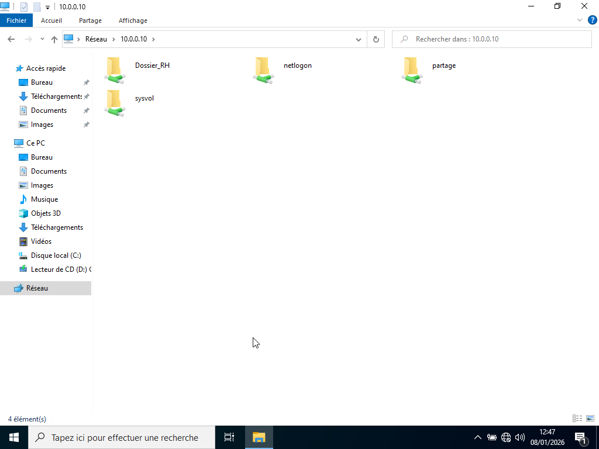
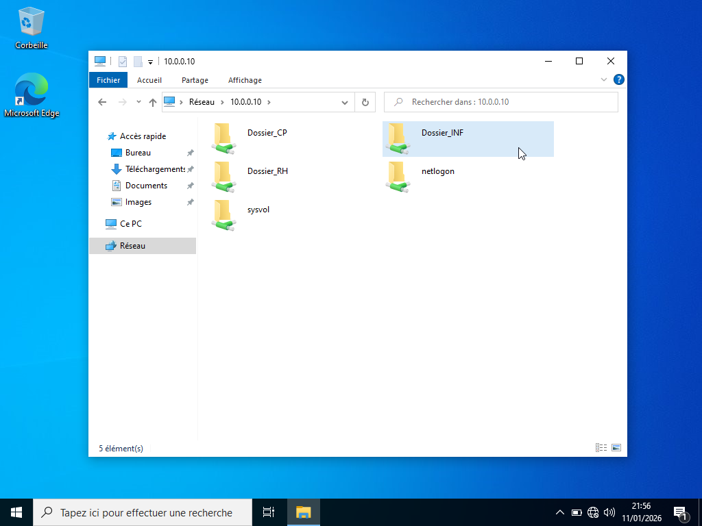
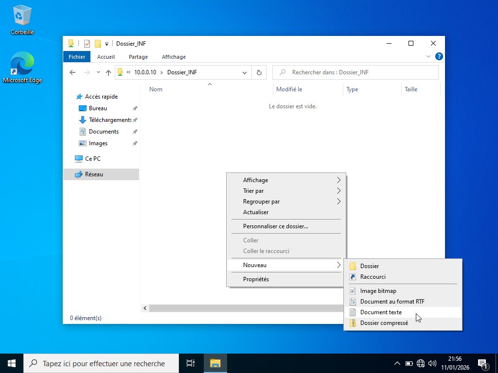
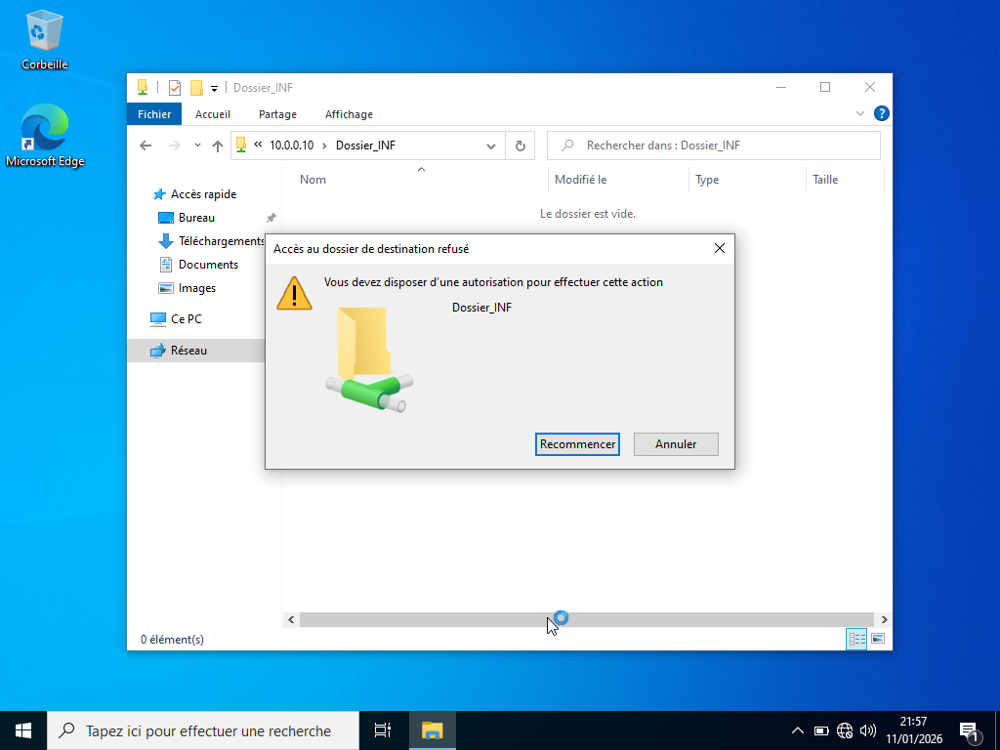
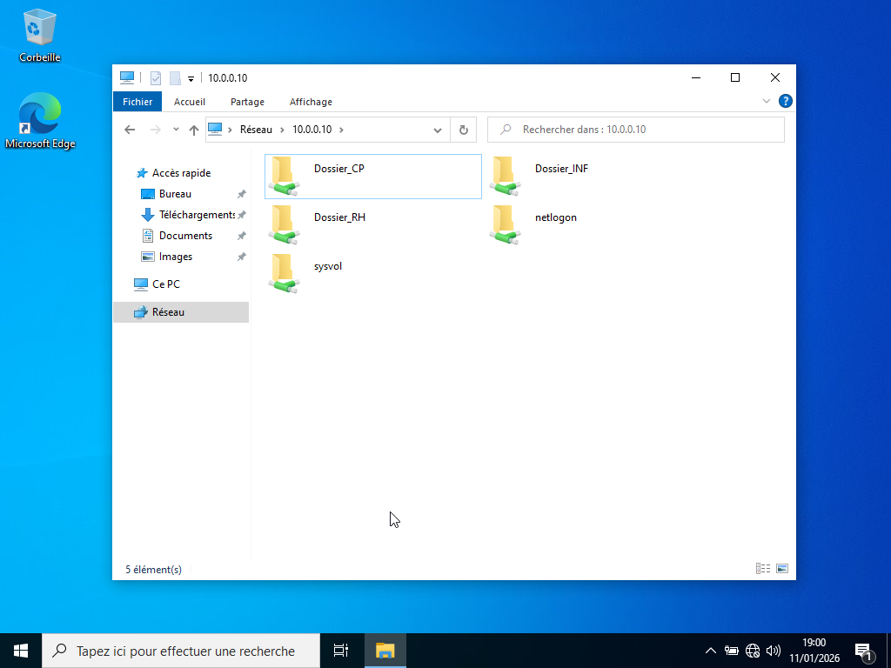
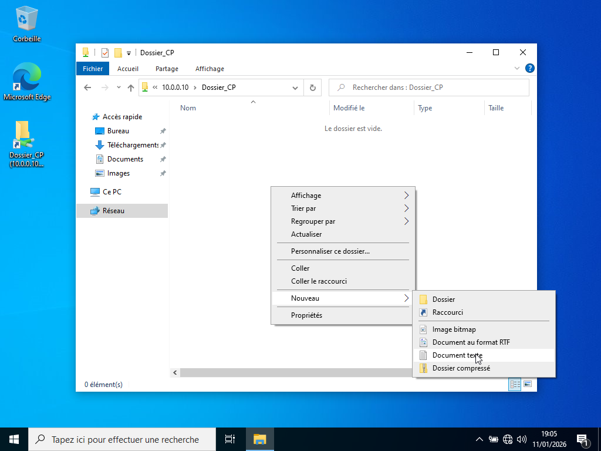
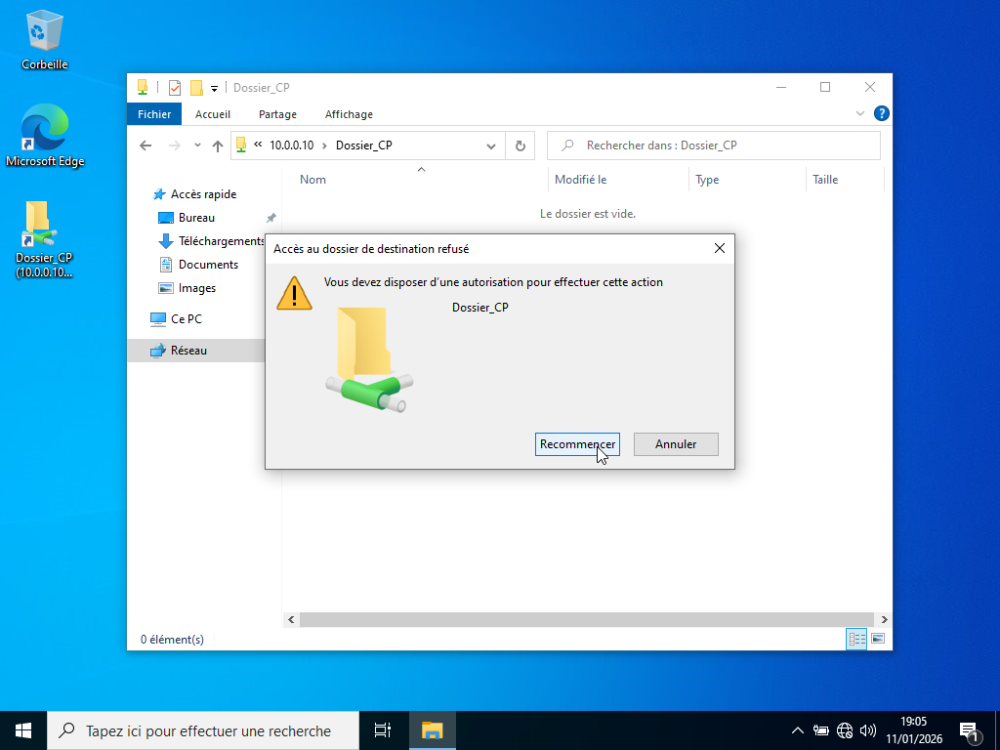

# VERIFICATION DES ACCES ET PERMISSIONS NTFS

---

## Objectifs :

Vérifier que :
- Les utilisateurs peuvent accéder aux ressources selon les droits de partage SMB définis.
- Les permissions NTFS appliquées sur le dossier partage correspondent aux règles prévues.

---

## Procédure :

La procédure utilisée est la suivante : 

1. Depuis le poste client, ouvrir l’explorateur de fichiers.

2. Dans la barre d’adresse, saisir pour vérifier l'accès aux partages : \10.0.0.10\ 

3. Vérifier les permissions.

| Dossiers     | DLG      |  GG       |  Utilisateur   | Permissions NTFS                                                                     |
|--------------|----------|-----------|----------------|--------------------------------------------------------------------------------------|
| Dossier_RH   | DLG_RH   |  GG_RH    |  Placide       | Change (Modification) : Lecture + modification, suppression, création de fichiers.   | 
| Dossier_INF  | DLG_INF  |  GG_INF   |  Fortuné       | Read (Lecture) : L’utilisateur peut lire, ouvrir, lister les fichiers.               |
| Dossier_CP   | DLG_CP   |  GG_CP    |  Hugues        | Read (Lecture) : L’utilisateur peut lire, ouvrir, lister les fichiers.               |

---

## Démonstrations :

- Vérification accès et permissions NTFS au Dossier_RH

- Vérification accès et permissions NTFS au Dossier_INF

- Vérification accès et permissions NTFS au Dossier_CP

