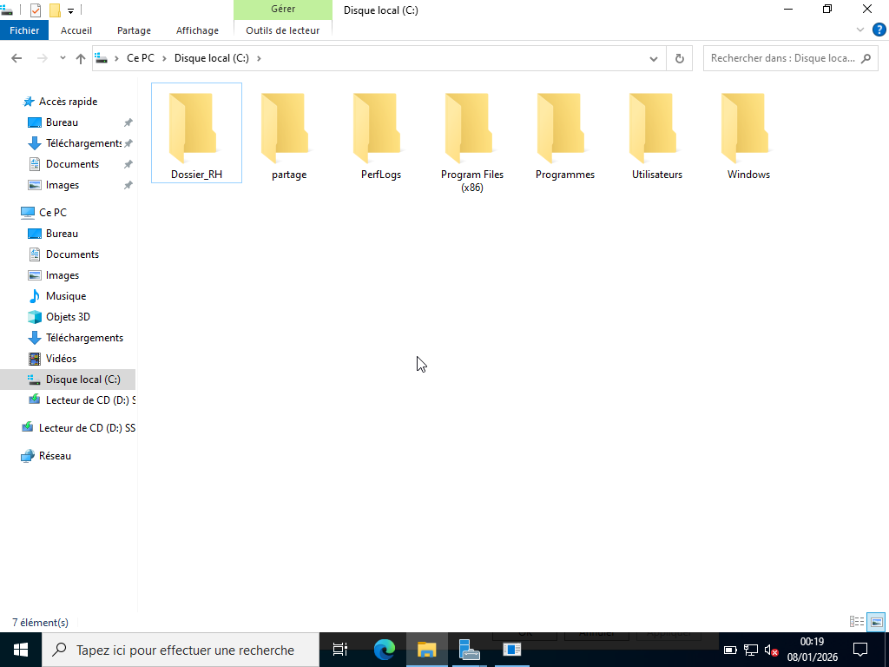
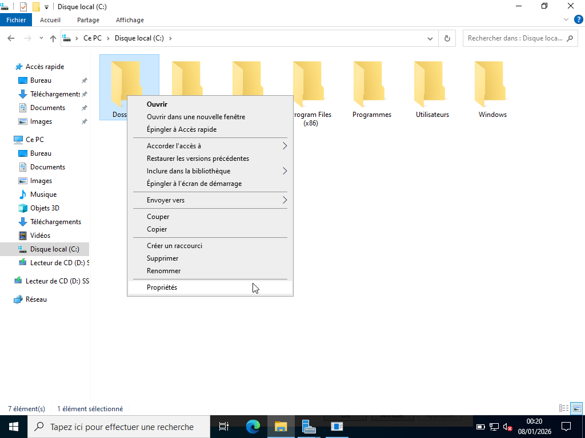
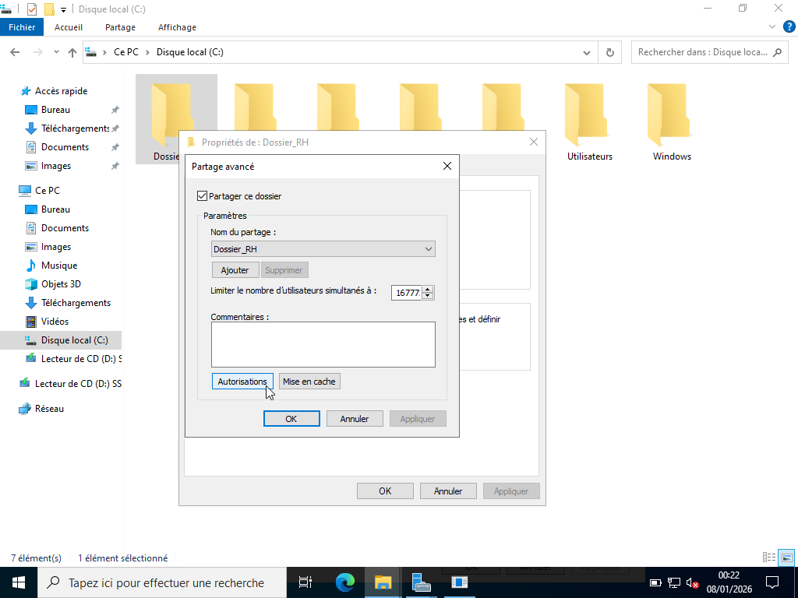
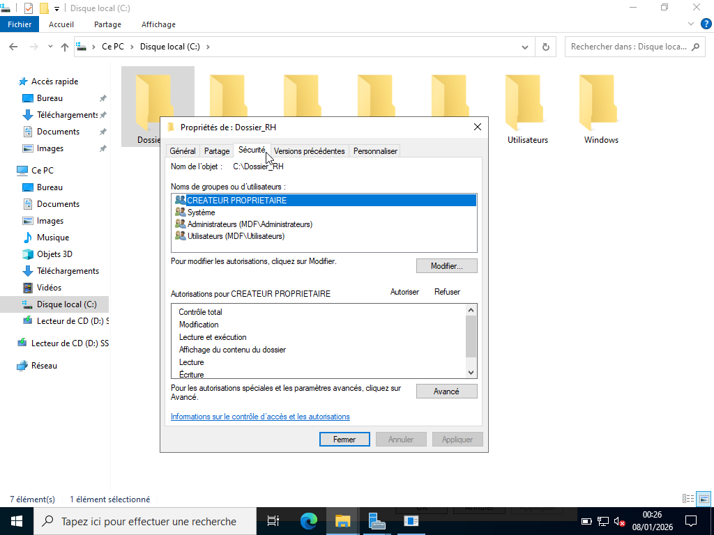
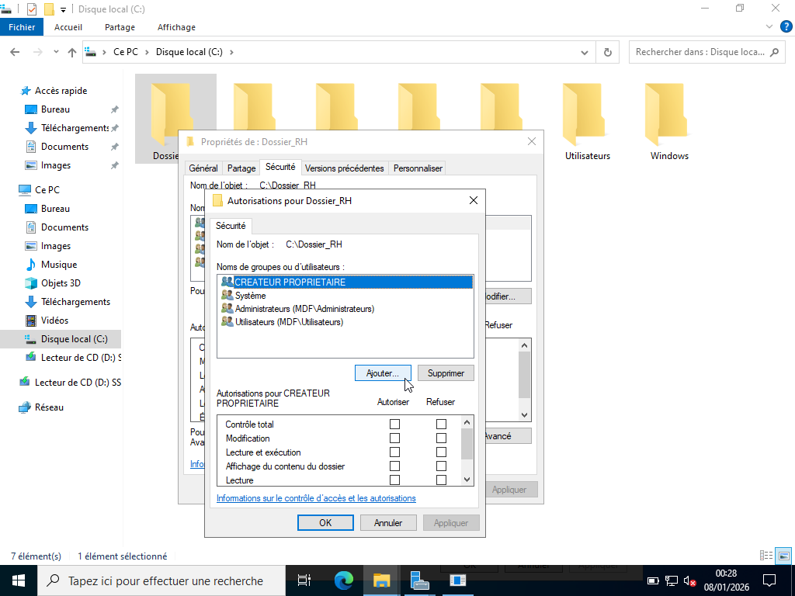
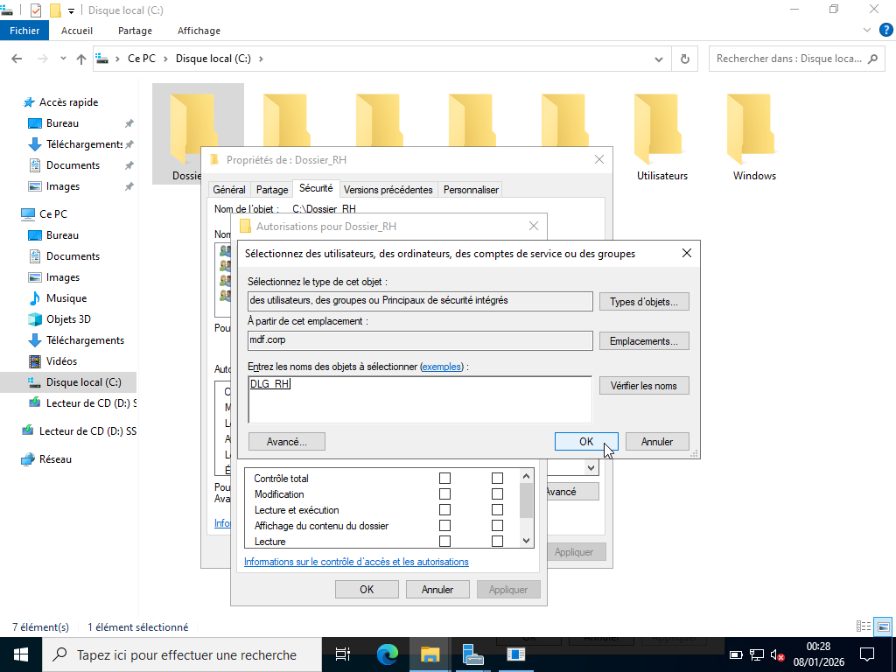
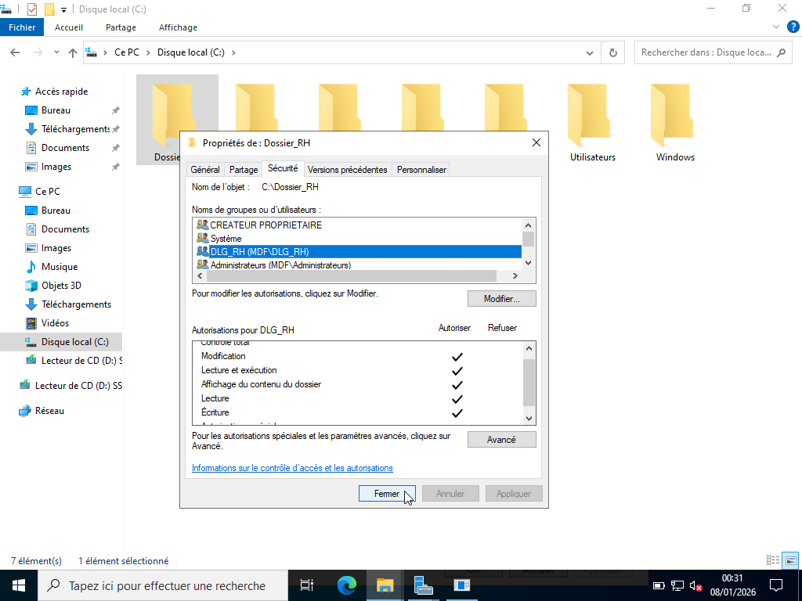

# ATTRIBUTION DES PERMISSIONS NTFS / SMB

---

## Objectif :

L’attribution des permissions est l’étape où le groupe domaine local (DLG) 
reçoit les droits d’accès sur le dossier partagé du serveur.

---

## Permissions droits de partage (SMB) :

Les permissions SMB s’appliquent au niveau du partage en suivant la procédure 
suivante :

1. Clic droit sur le dossier (ex : Dossier_RH)

2. Propriétés 

3. Onglet Partage 

4. Partage avancé 

5. Cocher Partager ce dossier 

6. Cliquer sur Autorisations 

7. Supprimer “Tout le monde” 

8. Ajouter le Groupe Domaine Local (ex : DLG_RH) 

9. Donner les droits associés au groupe. (ex : Full Control).

| Dossiers     | OU_Groupes   | Permissions droit de partage (SMB)                                                   |
|--------------|--------------|--------------------------------------------------------------------------------------|
| Dossier_RH   | DLG_RH       | Full Control (Contrôle total) : Modification + gestion des permissions du partage.   | 
| Dossier_INF  | DLG_INF      | Change (Modification) : Lecture + modification, suppression, création de fichiers.   |
| Dossier_CP   | DLG_CP       | Read (Lecture) : L’utilisateur peut lire, ouvrir, lister les fichiers.               |

---

## Démonstration :

- Permissions SMB du Dossier_RH

- Permissions SMB du Dossier_INF

- Permissions SMB du Dossier_CP

---

## Permissions NTFS :

Les permissions NTFS s'appliquent sur le disque dans l'onglet sécurité en suivant la procédure suivante :

1. Clic droit sur le dossier (ex : Dossier_RH)

2. Propriétés

3. Onglet sécurité

4. Cliquer sur Modifier

5. Ajouter le Groupe Domaine Local (ex : DLG_RH)

6. Donner les droits associés au groupe. (ex : Change).

| Dossiers     | OU_Groupes   | Permissions NTFS                                                                     |
|--------------|--------------|--------------------------------------------------------------------------------------|
| Dossier_RH   | DLG_RH       | Change (Modification) : Lecture + modification, suppression, création de fichiers.   | 
| Dossier_INF  | DLG_INF      | Read (Lecture) : L’utilisateur peut lire, ouvrir, lister les fichiers.               |
| Dossier_CP   | DLG_CP       | Read (Lecture) : L’utilisateur peut lire, ouvrir, lister les fichiers.               |

---

## Démonstrations : 

- Permissions NTFS du Dossier_RH

- Permissions NTFS du Dossier_INF

- Permissions NTFS du Dossier_CP
