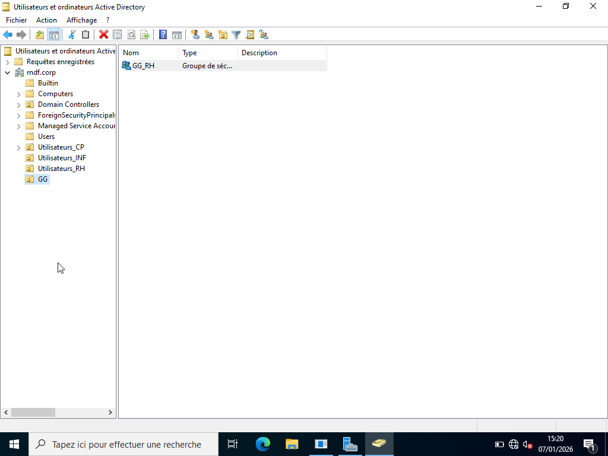

# CREATION GG ET DLG

---

## Objectif :

Le groupe global (GG) représente le rôle métier dans l’entreprise. Il sert à regrouper les utilisateurs selon leur service afin d’appliquer ensuite le modèle AGDLP. 
Tandis que Le groupe domaine local (DLG) est utilisé pour attribuer les permissions NTFS et SMB sur le dossier partagé du serveur. 

---

## Procédure création GG :

Pour la création d'un GG, la procédure utilisée est la suivante  :

1. Aller dans : OU_Groupes → GG 

2. Clic droit → Nouveau → Groupe 

3. Renseigner : 

- Nom du Groupe Global (ex : GG_RH) 

- Portée : Global 

- Type : Sécurité 

4. Valider. 

| Services              | OU_Groupes       |
|-----------------------|------------------|
| Ressources Humaines   | GG_RH            | 
| Informatique          | GG_INF           |
| Comptabilité          | GG_CP            | 

---

## Démonstration création GG : 

- Création du GG_RH

---

## Procédure création DLG :

Pour la création d'un DLG, la procédure utilisée est la suivante  :

1. Aller dans : OU_Groupes → DLG 

2. Clic droit → Nouveau → Groupe 

3. Renseigner : 

- Nom du Groupe Global (ex : DLG_RH) 

- Portée : Local de domaine

- Type : Sécurité 

4. Valider. 

| Services              | OU_Groupes        |
|-----------------------|-------------------|
| Ressources Humaines   | DLG_RH            | 
| Informatique          | DLG_INF           |
| Comptabilité          | DLG_CP            | 

---

## Démonstration création DLG : 

- Création du DLG_RH

---

## Procédure d'ajout de l'utilisateur au GG :

Pour l'ajout de l'utilisateur au GG, la procédure utilisée est la suivante :

1. Aller dans l’OU contenant l’utilisateur (ex : Utilisateurs_RH) 

2. Clic droit sur l’utilisateur (ex : Placide) 

3. Sélectionner Ajouter au groupe 

4. Entrer le groupe global (ex : GG_RH) 

5. Valider.

| Services              | OU_Groupes       | Utilisateurs   |
|-----------------------|------------------|----------------|
| Ressources Humaines   | GG_RH            |  Placide       |
| Informatique          | GG_INF           |  Fortuné       |
| Comptabilité          | GG_CP            |  Hugues        |

---

## Démonstration d'ajout de l'utilisateur au GG :

- Ajout de l'utilisateur Placide au GG_RH

---

## Procédure d'ajout du GG au DLG :

Pour l'ajout du GG au DLG, la procédure utilisée est la suivante :

1. Aller dans : OU_Groupes → GG 

2. Clic droit sur le groupe global (ex : GG_RH)
 
3. Sélectionner Ajouter au groupe 

4. Entrer le Groupe Domaine Local (ex : DLG_RH) 

5. Valider.

| Services              | OU_Groupes       | OU_Groupes     |
|-----------------------|------------------|----------------|
| Ressources Humaines   | GG_RH            |  DLG_RH        |
| Informatique          | GG_INF           |  DLG_INF       |
| Comptabilité          | GG_CP            |  DLG_CP        |

---

## Démonstration d'ajout du GG au DLG :

- Ajout du GG_RH au DLG_RH

