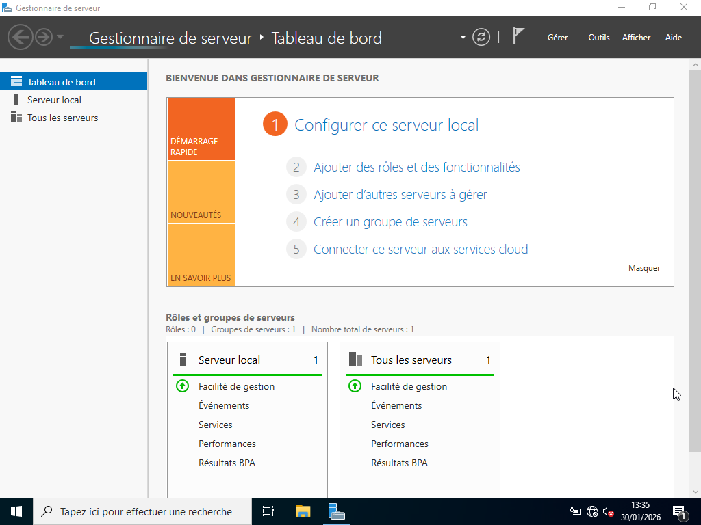
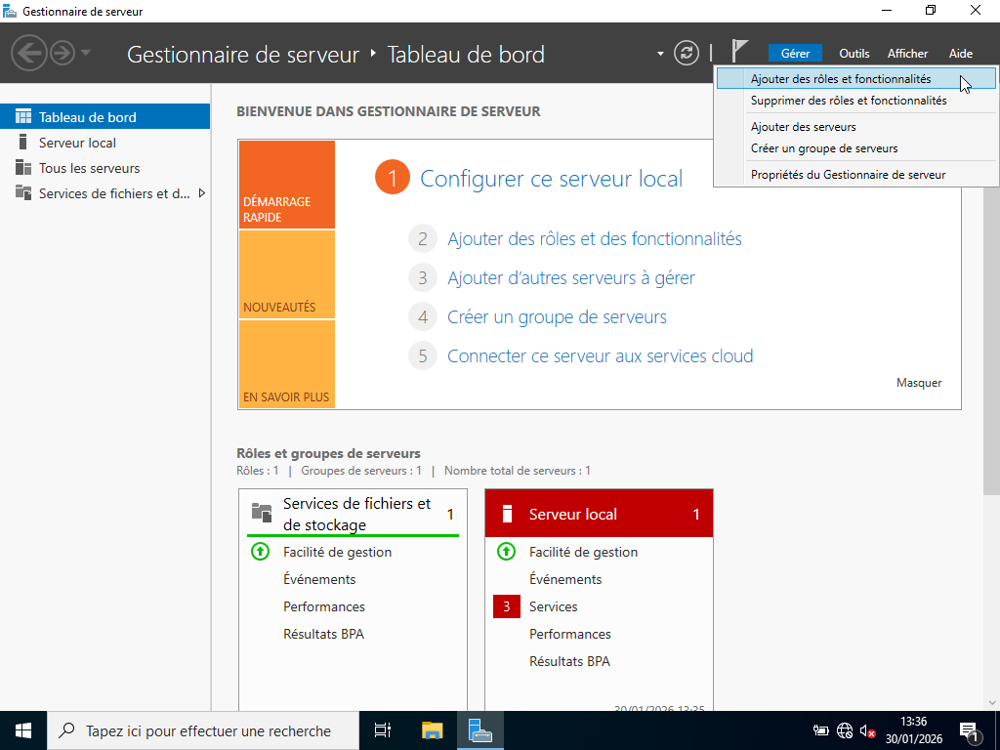
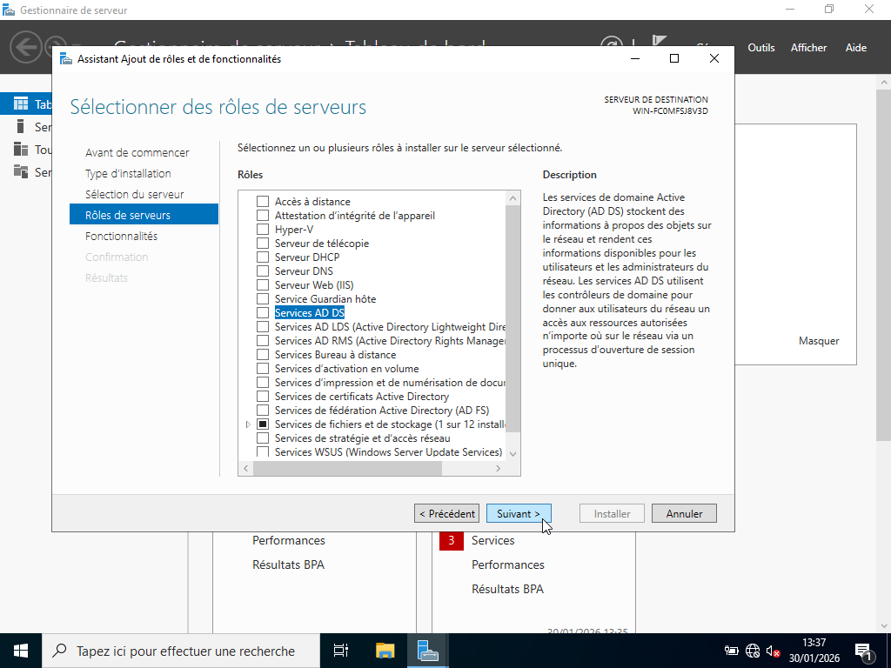
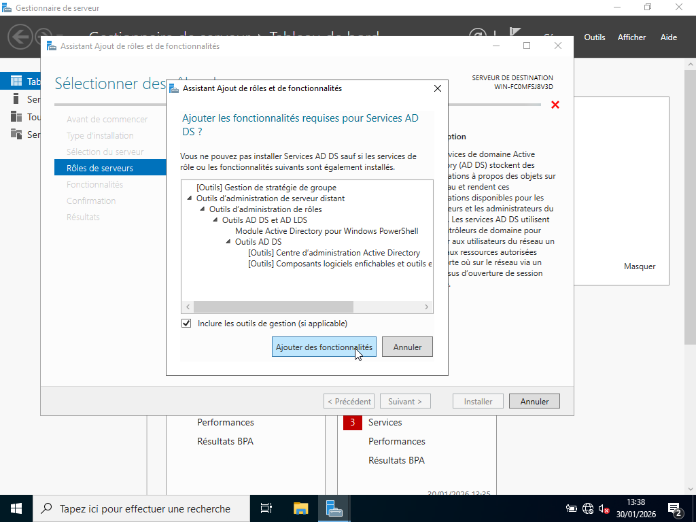
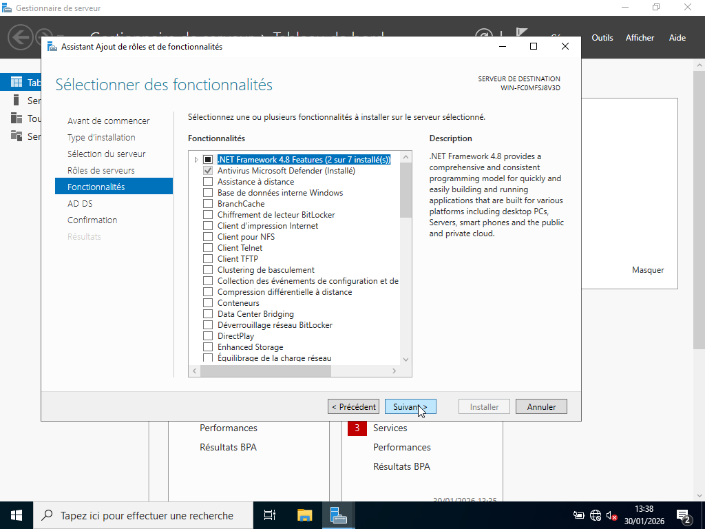
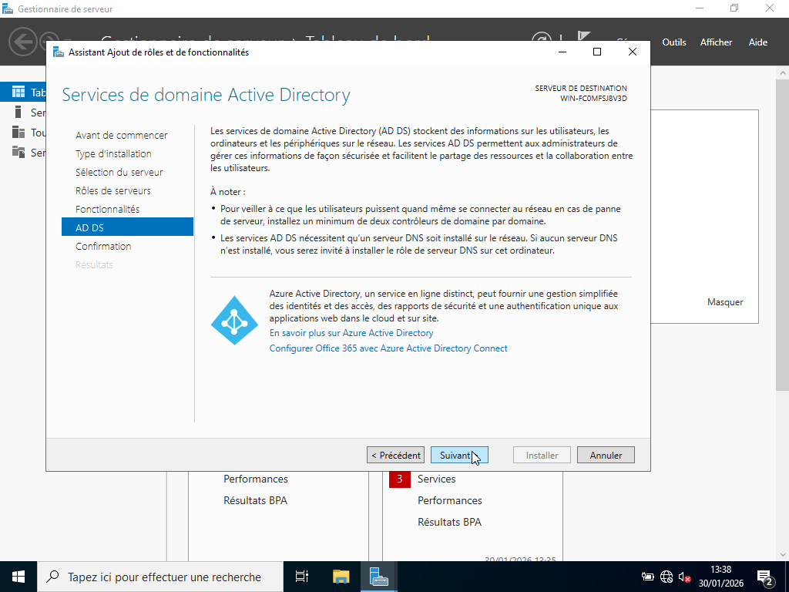
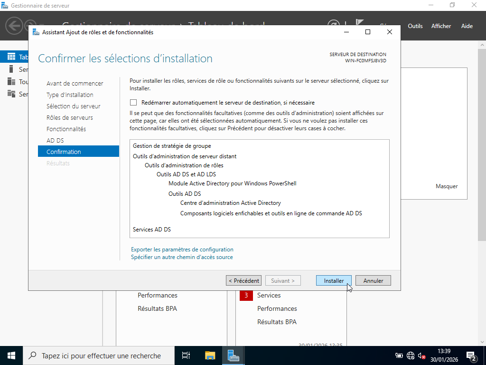
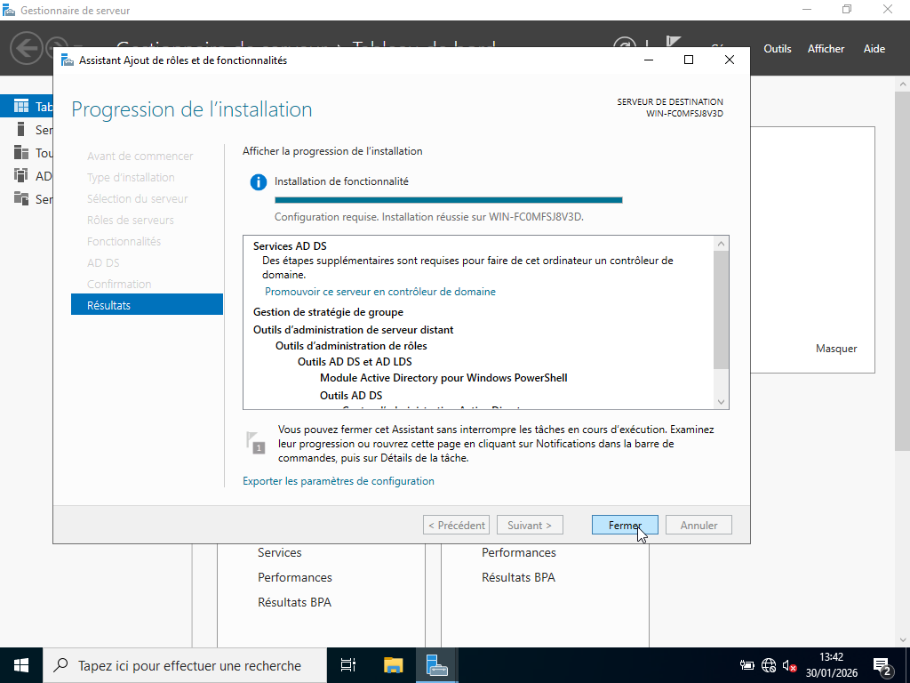
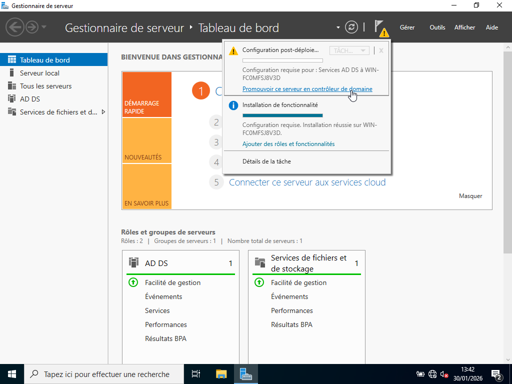

# Projet 1 : Habilitation Active Directory

---

## I. Contexte :

Dans le cadre de ma formation en BTS SIO et de ma montée en compétences en administration système, j’ai choisi de mettre en place sur un environnement virtuel VirtualBox une infrastructure Active Directory complète afin de comprendre et maîtriser les mécanismes d’habilitation, de gestion des utilisateurs et de sécurisation des accès. L’objectif est de simuler un environnement de travail du Groupe MDF comprenant deux services (Informatique, Comptabilité) et de mettre en œuvre une gestion des permissions conforme au modèle AGDLP. 

---

## II. Présentation de l’architecture : 

L’infrastructure se compose des éléments suivants : 

- serveur Windows Server jouant le rôle de contrôleur de domaine (DC). Il héberge les services essentiels : Active Directory Domain Services (AD DS), DNS, gestion des utilisateurs, des groupes et des stratégies de sécurité. 

- domaine Active Directory structuré selon une logique professionnelle. Le domaine permet l’authentification centralisée des utilisateurs et la gestion des permissions via le modèle AGDLP. 

- unités d’organisation (OU) permettant de structurer les utilisateurs, les groupes et les postes clients. Cette organisation facilite l’application de stratégies de groupe (GPO) et la gestion des habilitations. 

- groupes globaux (GG) représentant les rôles métiers (Informatique, Comptabilité). Ils regroupent les utilisateurs selon leur fonction. 

- groupes locaux de domaine (DLG) associés aux ressources partagées. Ils reçoivent les permissions NTFS et SMB sur les dossiers du serveur. 

- d'un poste client Windows Pro intégré au domaine. Il permet aux utilisateurs de se connecter avec leur compte AD et d’accéder aux ressources selon leurs droits. 

- dossiers partagés sur le serveur, organisés par service (Informatique, Comptabilité). Chaque dossier est protégé par des permissions adaptées au rôle des utilisateurs. 

---

## III. Réalisations : 

Pour en arriver au résultat de l'habilitation au travers de active directory, j’ai installé VirtualBox sur une machine physique, ensuite un serveur Windows Server jouant le rôle de contrôleur de domaine ainsi qu'un poste client Windows relié au domaine. J’ai ensuite créé des unités d’organisation, des groupes globaux, des groupes locaux de domaine et des utilisateurs, afin de structurer les droits d’accès aux dossiers partagés. Ce projet permet de reproduire une architecture professionnelle et de démontrer ma capacité à organiser, sécuriser et documenter une infrastructure Active Directory.

---

## III.1. Installations :

## Installation VirtualBox :

## Installation Windows Server et AD :

## Installation du poste client :

## III.2. Configurations :

## Configuration VirtualBox :

## Configuration Windows server :

## Configuration et jonction du poste client au domaine :

## III.3. Application méthode AGDLP :

