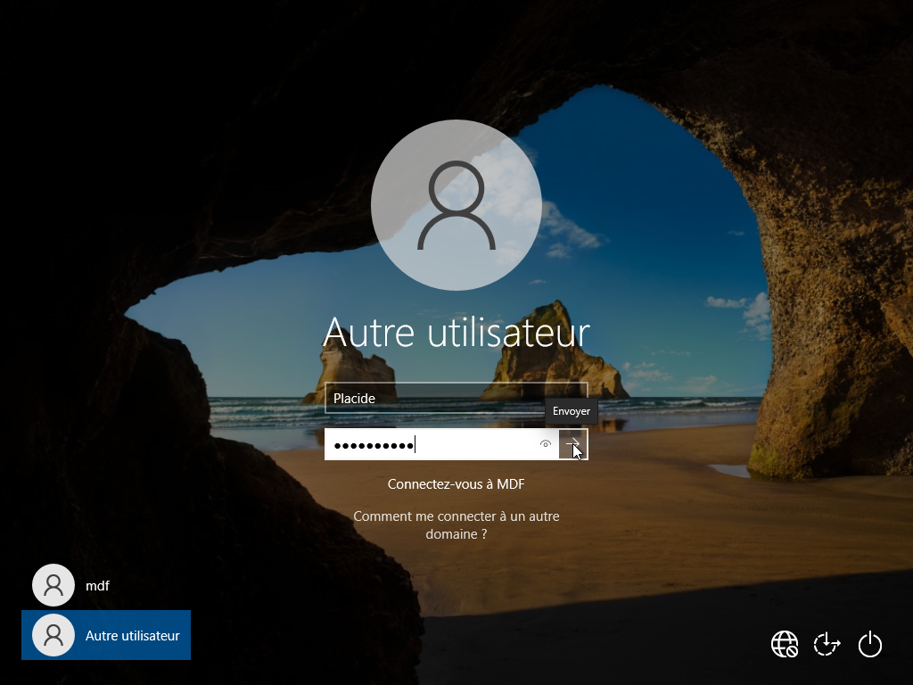

# CONNEXION UTILISATEUR AU DOMAINE 

---

## Objectif :

Vérifier qu’un poste client Windows peut s’authentifier correctement auprès du domaine (ex : mdf.corp).

---

## Procédure :

La procédure utilisée est la suivante :

1. Démarrer le poste client joint au domaine. 

2. À l’écran de connexion, sélectionner Autre utilisateur. 

3. Saisir les identifiants d’un utilisateur du domaine : 

- Nom d’utilisateur : (ex : mdf\Placide) 

- Mot de passe : (celui défini dans Active Directory).

- Valider la connexion. 

---
 
## Résultat attendu : 

La session s’ouvre sans erreur, le poste affiche le domaine dans les informations de session, l’utilisateur accède avec son profil Windows. 

---

## Démonstration :

Voir ci-dessous, une démonstration imagée sur la connexion de l’utilisateur au domaine. 

